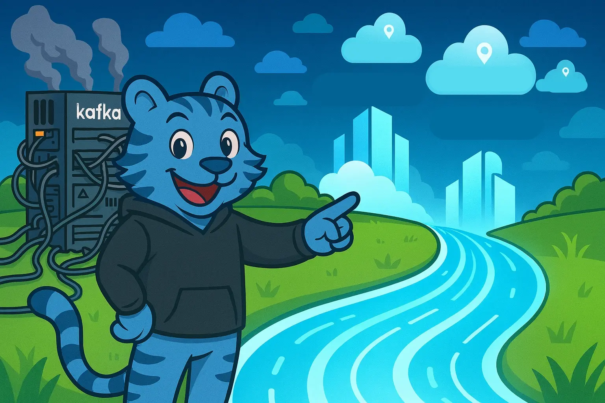
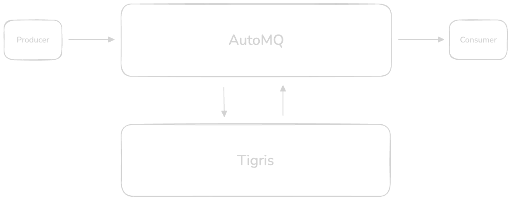
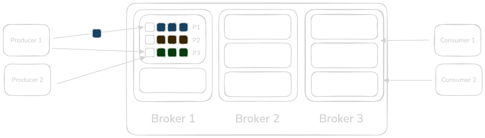
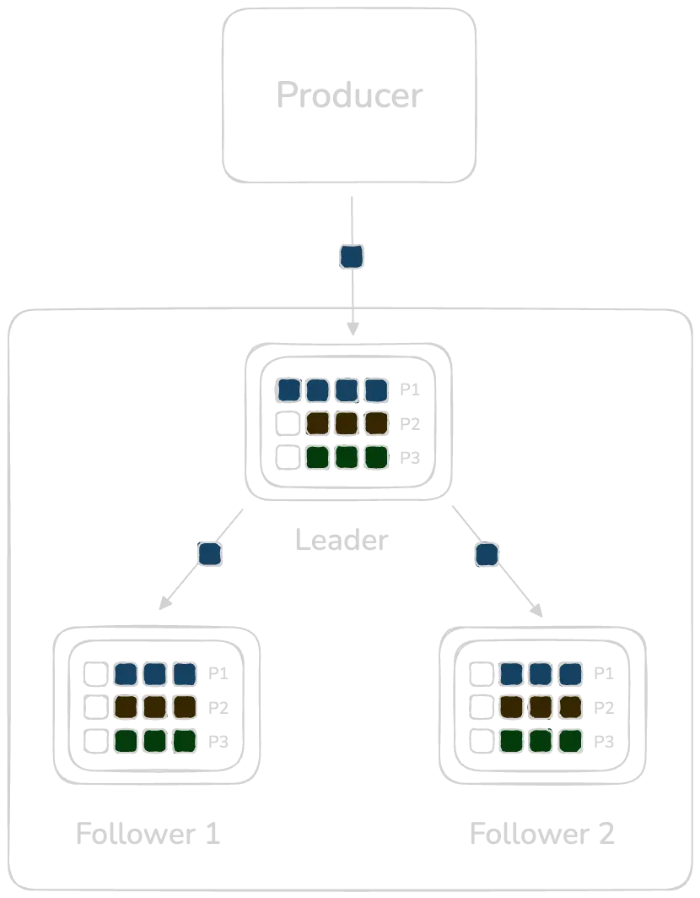
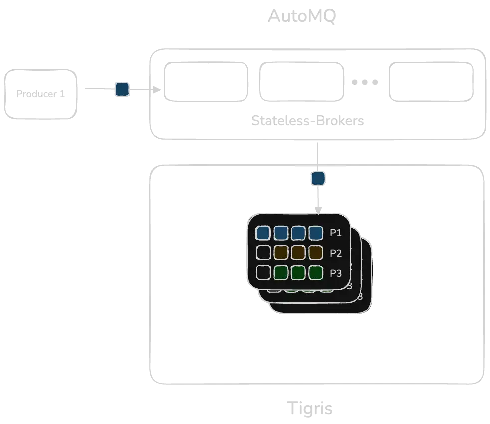
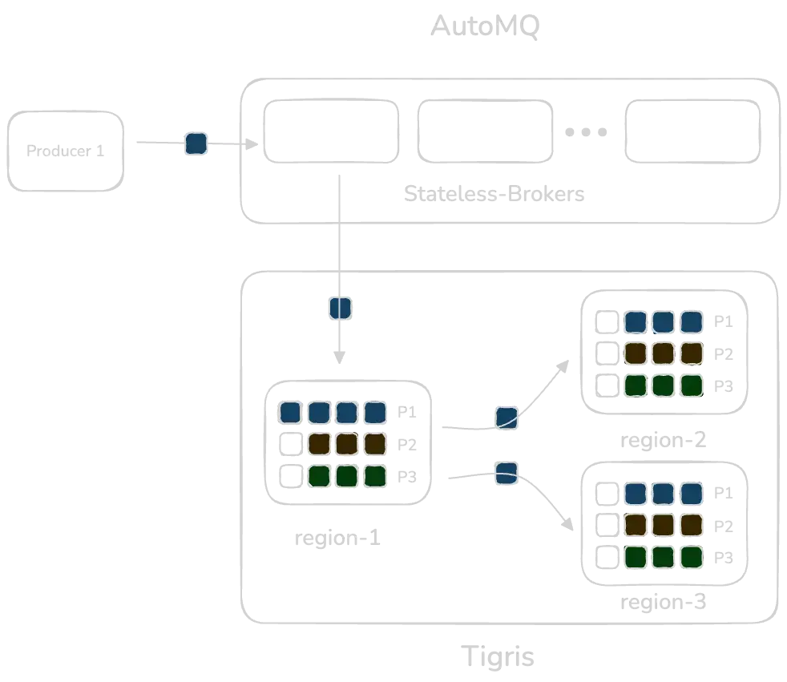
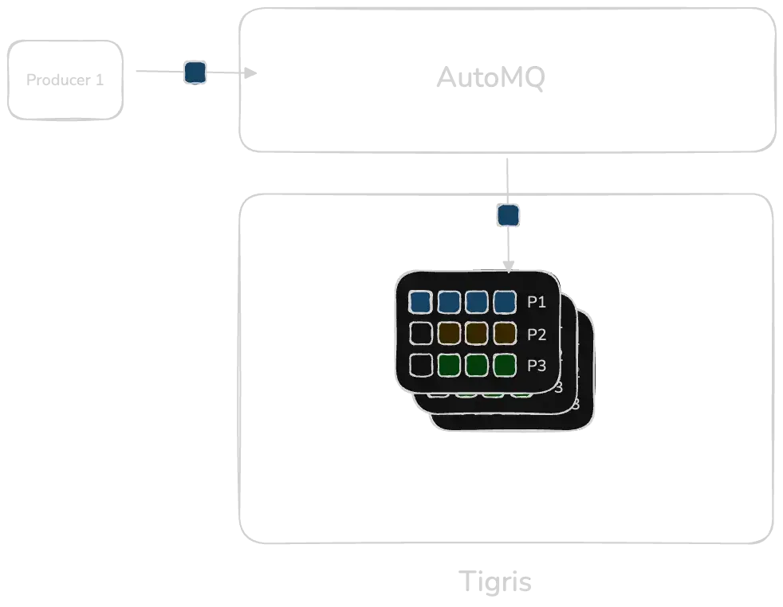

import InlineCta from "@site/src/components/InlineCta";



# Scaling Kafka with AutoMQ on Tigris

Apache Kafka has been the standard for event streaming and building reliable,
high-throughput, event-driven systems. However, as Kafka deployments scale
across clouds and regions, its core architectural choices start showing limits.

In this post, we'll walk through Kafka's fundamentals, its scaling bottlenecks,
and how AutoMQ with Tigris lets you scale storage and compute independently.

## What is AutoMQ

AutoMQ is a fully Kafka-compatible streaming engine that re-implements the Kafka
broker while preserving full protocol compatibility. Its defining architectural
change is delegating persistence entirely to object storage like Tigris via the
S3 API.

When you combine AutoMQ and Tigris:

- Brokers become fully stateless
- No local disks or attached volumes are required
- No intra-cluster replication is performed
- Storage is globally distributed with zero egress fees
- Compute and storage scale independently

Below is the architecture overview of AutoMQ and Tigris.



## Where Kafka struggles at scale

AutoMQ paired with Tigris addresses several of Kafka's limitations at scale,
including:

- Durability and partition replication overhead
- Slow, data-heavy partition reassignment
- Manual and operationally complex cluster balancing

To understand why these issues appear, we'll first explore Kafka's fundamental
design.

## Kafka in a nutshell

Fundamentally, Kafka is a distributed event streaming system made up of servers
and clients.

Clients that write data are called **Producers**, and clients that read data are
**Consumers**.

On the server side, Kafka is built around three core abstractions:

- **Topics**: named event streams (like tables in a database)
- **Partitions**: each topic is divided into one or multiple partitions
- **Brokers**: servers that store partitions locally on disk

Producers append messages to partitions while consumers read them sequentially.
Kafka guarantees ordering within a partition and durable persistence on disk.



### Durability & replication

Kafka ensures durability by maintaining at least 3 replicas per partition. Each
partition has a leader and multiple followers forming an In-Sync Replicas (ISR)
that must be nearly caught up with the leader's writes.



The replication flow is as follows: Producer writes to the leader. The leader
writes to disk via page cache. Followers then fetch the new data from the leader
that they persist and report back to the leader.

The downside with this approach is that every partition write becomes a fan-out
stream to multiple brokers. At high throughput, the replication traffic
dominates network usage, which forces operators to scale to larger EC2 instances
and/or higher-bandwidth connections.

### How AutoMQ and Tigris solve durability and replication

AutoMQ offloads the durability layer to Tigris as it inherently provides
multiple replicas, offering extremely high data durability. Consequently, AutoMQ
offers higher throughput by eliminating the need for data redundancy replication
overhead.



A producer writes to any AutoMQ broker. The broker streams log segments directly
into Tigris. Tigris stores each segment as an immutable object and replicates it
across regions. Through this design:

- All brokers can access the same data without replication
- There is no follower lag or ISR management
- Write throughput increases because internal fan-out disappears

Additionally, Tigris distributes the data globally, ensuring regional latencies
for Producers and Consumers.



The diagram illustrates how AutoMQ operates when backed by Tigris object
storage. A producer sends records to any AutoMQ broker, which remains stateless.
Instead of writing log segments to local disk or replicating them across
brokers, the broker streams each segment directly into Tigris. Tigris stores
these segments as immutable objects per partition (P1, P2, P3) and replicates
them across multiple regions. Because replication happens entirely within the
storage layer, all brokers in any region see the same partition data without ISR
management, follower lag, or inter-broker traffic.

## Partition and cluster rebalancing

### The challenges with rebalancing Kafka

Kafka stores data locally on each broker. When the cluster scales in or out,
Kafka must:

- Copy partition data to new brokers
- Rebuild replicas
- Re-distribute leadership

This involves heavy disk I/O, large data movement, and long rebalancing
workflows. Redistributing data can take hours or days, disrupting cluster
performance.

AutoMQ eliminates this entire burden by shifting persistence to Tigris. By
decoupling storage and compute, brokers scale independently, ensuring reads and
writes operations are on and from Tigris, which acts as the source of truth.

Because the storage layer is shared, rebalancing becomes a lightweight metadata
update rather than a multi-gigabyte data transfer. This enables instant
partition reassignment, automatic traffic redistribution, and a continuously
running self-balancing engine that keeps the cluster healthy without operator
intervention.



## Connecting AutoMQ to Tigris

Getting started is as easy as exporting a keypair into the environment:

```bash
KAFKA_S3_ACCESS_KEY=tid_YOUR_ACCESS_KEY_HERE
KAFKA_S3_SECRET_KEY=tsec_YOUR_SECRET_KEY_HERE
```

Follow our guide on how to
[connect Tigris to an AutoMQ instance](https://www.tigrisdata.com/docs/quickstarts/automq/)
running locally using Docker.

More importantly, AutoMQ's wire protocol mirrors Apache Kafka's, so existing
clients, tooling and code remains unchanged. From an operator's standpoint,
AutoMQ behaves like Kafka but removes the storage management dimension.

## Conclusion

As Kafka scales, its dependence on local disks, ISR replication, and manual
balancing becomes cumbersome. AutoMQ scales Kafka by decoupling storage and
compute and moving durability, replication, and data distribution into Tigris'
globally replicated object storage layer. Brokers become stateless, and scale
instantaneously, while rebalancing becomes a metadata update.

<InlineCta
  title="Ready to scale your Kafka architecture?"
  subtitle="If you're ready to run a globally distributed, fully elastic streaming engine, try AutoMQ on Tigris and experience the future of event streaming."
  button="Get Started with AutoMQ and Tigris"
  link="https://www.tigrisdata.com/docs/quickstarts/automq/"
/>
