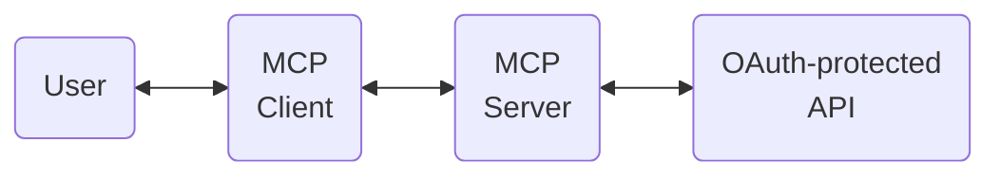
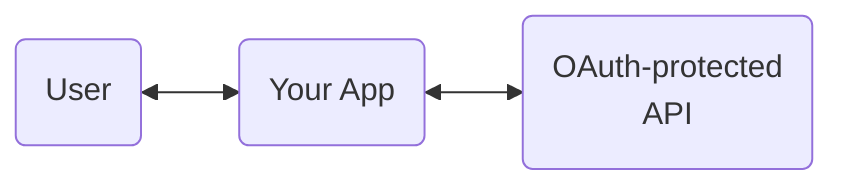
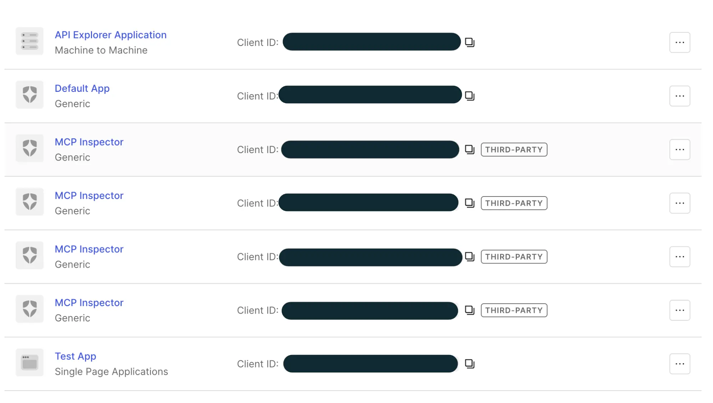
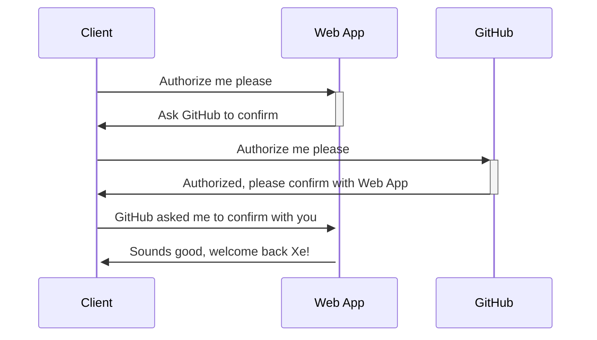
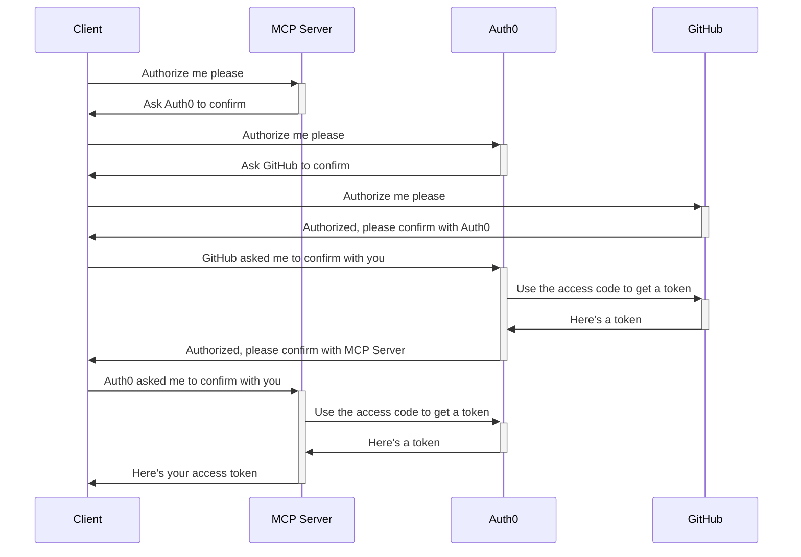
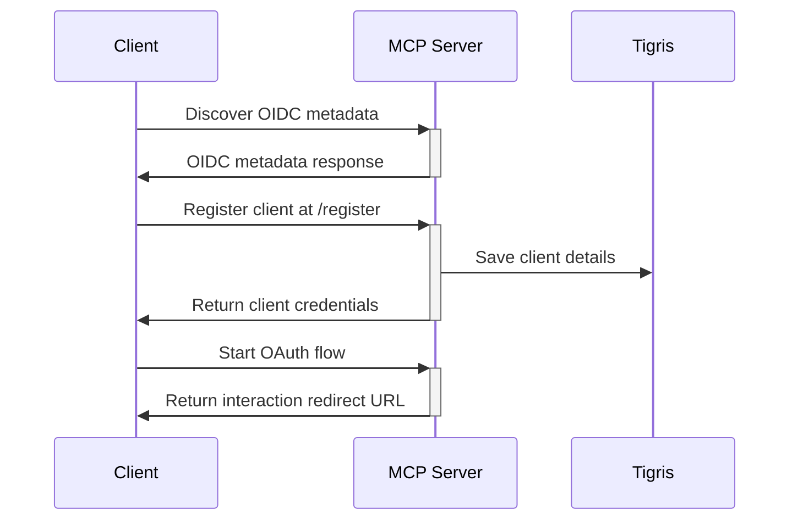
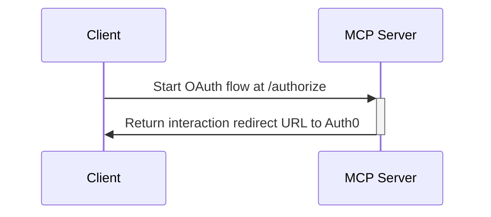
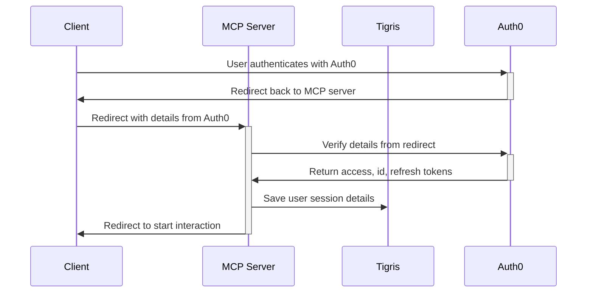
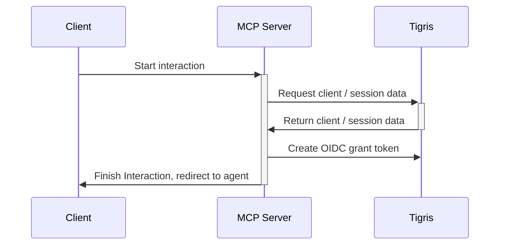
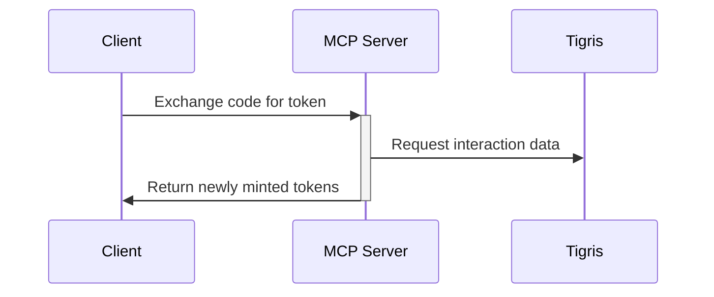

import InlineCta from "@site/src/components/InlineCta";

import heroimage from "./domo-arigato.webp";
import styles from "!!raw-loader!./styles.css";

<style>{styles}</style>


**TL;DR: your MCP Server needs to be an OIDC provider, a man-in-the-middle
pattern. If you wrote your MCP Server in JavaScript, use
[the oidc-provider](https://www.npmjs.com/package/oidc-provider) library to make
your life easier. Just add your key-value storage layer of choice to manage
state. We used Tigris as our kv store.**

Recently we announced the hosted version of our
[Model Context Protocol (MCP) server](https://www.tigrisdata.com/blog/hosted-mcp/)
so you can vibe code with Tigris to your heart’s content. One of the tricker
parts of building it was implementing OAuth 2 with Auth0– nothing seemed to work
out of the box, and every tutorial we could find was outdated just months after
publish. We hope that by writing this, we give you the guide to implementing MCP
OAuth that we wish we had when we set out on making our MCP server happen.
Today, you’ll learn all the moving parts and constraints that go into making MCP
Authentication work.

As a sneak preview into the madness we had to unveil, we ended up needing to
implement a hybrid OpenID Connect (OIDC) server where our MCP server is a
partial OIDC passthrough proxy to Auth0, but also issues its own tokens under
the hood. Ready? Let’s begin.

## MCP Authentication is easy, right?

In a typical web app, your backend is the OAuth client. The resource owner is
the human user. You manually configure a client ID and secret, redirect URL, and
register it with your identity provider of choice. But for an MCP server, the
resource owner is still the human user, but they configure their MCP client
(LLM, Cursor, etc) to make OAuth protected API calls on their behalf.

So your mental model is:



Instead of:



The OAuth flow is typically done in the browser with a redirect URL. But MCP
servers aren’t in browser, so they have to spawn their own HTTP server to
receive the right codes. Sometimes they can’t even do that, so they have the
identity provider spit out a code that users have to paste into their MCP
client. It’s a mess full of edge cases that have to be discovered and accounted
for.

The common patterns we see in implementing authentication for MCP are:

- 🤮 Users need to head to the admin panel of the service to generate an
  authentication that gets stored in the MCP server configuration file.
- 🤔 MCP client prints an authorization URL that the user pastes into their
  browser
- 🤨 MCP server requests a device code, gives it to the user, and polls the IdP
  until the user logs in
- ✅ MCP client manages the OAuth flow and passes a token to the MCP server

We picked the last option, but we hit a couple snags that others seem to be
hitting as well:

- MCP depends on a draft specification for
  [OAuth 2.1](https://datatracker.ietf.org/doc/html/draft-ietf-oauth-v2-1-13).
  This draft can and will change. Hopefully it doesn’t change in a way that
  breaks the entire MCP ecosystem\!
- Auth0 and other IDPs are built for a smaller number of statically defined
  third party apps, not potentially huge amounts of dynamically created third
  party apps (think: infinite lists of applications in the Auth0 UI, even with
  [OAuth dynamic client registration](https://datatracker.ietf.org/doc/html/rfc7591)
  configured correctly).

### The problem: MCP’s torrent of dynamic OAuth clients

At Tigris, we use Auth0 and whenever a dynamic client registers with Auth0, that
client gets its own entry in the list of authentication clients in the Auth0
panel. This means you quickly get overrun with duplicate entries for every AI
agent that every one of your users uses, like this:



As you can see, this does not scale cleanly. Sure, the identity provider could
do some work to show you which users are associated with those dynamic
applications, but this just ends up becoming onerous in practice. So we needed
to make some service that sits in the middle to hide this badness away.

### The solution: make your MCP server a man-in-the-middle

To make most IdPs reasonably functional for MCP servers, the MCP server itself
needs to act as an
[OpenID Connect (OIDC, or OAuth with opinions added)](https://openid.net/developers/how-connect-works/)
identity provider backed by your existing identity provider. In a regular web
app, you wouldn’t have to deal with this.

This pattern of having your app act as an OIDC server is common, examples from
[Clerk](https://clerk.com/docs/nextjs/guides/development/mcp/build-mcp-server),
[Cloudflare](https://github.com/cloudflare/ai/tree/main/demos/remote-mcp-auth0/mcp-auth0-oidc),
and [Simplescraper](https://simplescraper.io/blog/how-to-mcp) all have the MCP
server acting as a man in the middle. I’d imagine that they also have found UX
difficulties involved with dynamic client registration or are using identity
providers that do not support it. Either way, this also does allow you to limit
the capabilities of the MCP server from an upstream level, which can allow a
much more clean separation of responsibilities.

## Our sins laid bare: Making our MCP Server an OIDC client backed by a kv store

Our MCP server is a Node.js app written with [Express](https://expressjs.com/)
using the
[Model Context Protocol SDK](https://github.com/modelcontextprotocol/typescript-sdk).
In order to avoid overloading Auth0 with a flood of dynamically registered
clients, we made our MCP server a dual OIDC provider and OIDC client. When you
authenticate with our MCP server, it proxies some OAuth calls to Auth0 and then
uses that to facilitate its own session minting logic.

Practically, this means that instead of having clients use the IdP hosted
endpoints found in `/.well-known/`, like `/authorize`, `/token`, or `/register`,
you implement those 6ish endpoints directly on your MCP server. Even then, you
don’t actually have to implement them yourself if you use the
[oidc-provider](https://www.npmjs.com/package/oidc-provider) package like we
did:

```ts
import { Adapter, Provider } from 'oidc-provider';
export const createOAuthProvider = (
  issuerUrl: string,
  auth0Config: Auth0Config,
  storageAdapter: Adapter,
): { provider: Provider; customRoutes: Router } => {
  // Create OIDC Provider instance
  const provider = new Provider(
    issuerUrl,
    createOidcProviderConfig(storageAdapter);
  );
...
  return { provider, customRoutes };
};
```

The [oidc-provider](https://www.npmjs.com/package/oidc-provider) package
implements these endpoints for you.

Without a library in the middle, you need to create a few routes in your webapp.
Keep in mind that the openid-configuration route
[RFC-2119-MUST](https://datatracker.ietf.org/doc/html/rfc2119) be at the
`/.well-known/openid-configuration` route otherwise clients will not be able to
discover where to do OAuth exchanges. Here’s some example routes based on what I
personally find reasonable:

- `GET /.well-known/openid-configuration`: returns a JSON object representing
  [OpenID Connect configuration](https://swagger.io/docs/specification/v3_0/authentication/openid-connect-discovery/),
  which lets OAuth 2 clients know where they need to go in order to mint access
  tokens, renew expired access tokens, what capabilities the OAuth server
  exposes, and other information that normally needs to be hard-coded into
  applications. Among other things, this will include all the other routes.
- `POST /api/oauth2/register`: the
  [OAuth Dynamic Client Registration endpoint](https://datatracker.ietf.org/doc/html/rfc7591#section-3.1),
  which allows clients to mint OAuth Client ID and Client Secret credentials
  on-demand. These credentials will be used for the rest of this process and the
  client is expected to store them persistently in a secret store.
- `GET /api/oidc/authorize`: The
  [OIDC authorization endpoint](https://openid.net/specs/openid-connect-core-1_0.html#HybridAuthorizationEndpoint)
  which renders the HTML form for users to confirm their authentication.
- `GET /api/oidc/token`: The
  [OIDC token endpoint](https://openid.net/specs/openid-connect-core-1_0.html#TokenEndpoint)
  which turns authorization grants from requests into access tokens. This is how
  you confirm user logins when they get redirected back to you.
- `GET /api/oidc/userinfo`: The
  [OIDC User Info endpoint](https://openid.net/specs/openid-connect-core-1_0.html#UserInfo)
  which lets you get well-known information about users such as their name,
  email address, and preferred username.

But seriously, use the library. It will take care of the majority of the OAuth
flow for you.

### Adding a stateful backend

When you implement this OIDC man in the middle approach, this makes your MCP
server _stateful_ instead of _stateless_. When you create OIDC sessions, client
credentials, and all of the other state tokens, you need to store them
somewhere. This shift from statelessness to statefulness can dramatically
complicate deployment of your MCP server depending on the Facts and
Circumstances™ of your deployment stack.

In order to keep our state management simple, our implementation uses Tigris as
its storage backend. This means that all of Tigris’
[efficient handling of many small files](https://www.tigrisdata.com/blog/benchmark-small-objects/)
and
[implicit global replication](https://www.tigrisdata.com/blog/talks/2025/global-replication/)
works to our advantage. (This does come at the cost of our MCP server being
unavailable when Tigris is down, but if Tigris is down then you can’t really use
the Tigris MCP server in the first place… and we’re over 99.99% available
anyway).

Here’s what we store in Tigris. It’s a bunch of JSON that could fit into any kv
store (even Postgres\!):

- Information about OAuth 2 clients created by dynamic client registration (eg:
  `oauth2:client:${clientID}`)
- Information about OAuth sessions / authentication tokens with Auth0 (eg:
  `oauth2:session:${sessionID}`)
- Information about authentication and refresh tokens that the MCP server uses
  (eg: `oauth2:token:${tokenID}`)

The library handles saving state to the storage backend, just add your own
[`adapter`](https://github.com/panva/node-oidc-provider/blob/HEAD/docs/README.md#adapter).
Adapters are custom. We use one for Tigris (reach out if you’d like to use
it\!).

### OAuth turtles all the way down

Another thing to keep in mind is that doing this means you need to add yet
another level of indirection to your authentication flow. Normally the OAuth
flow for a Web App that uses GitHub for authentication looks like this:



In contrast, our authentication flow with the MCP Server and an Auth0 user
backed by GitHub looks a bit more like this:



More complicated, certainly, but most of this is handled ambiently by
authentication providers and library code. In most cases, you’ll only need to
implement setting up the Provider itself. In addition to the Adapter.

More complicated, certainly, but most of this is handled ambiently by
authentication providers and library code. In most cases, you’ll only need to
implement setting up the Provider itself. In addition to the Adapter.

### Client Registration

In order for any OAuth or OIDC logic to happen, the Client needs to register as
an OAuth application with the MCP server. To make it happen, the Client makes a
new application using the
[RFC7591 OAuth Dynamic Client Registration Protocol](https://datatracker.ietf.org/doc/html/rfc7591):



When registering with the server, the MCP client sends a request with
information about the OAuth application kinda like this:

```javascript
fetch("https://mcp.storage.dev/register", {
  method: "POST",
  body: JSON.stringify({
    "client_name": "Glorbotron Coding Agent",
    "redirect_uris": "glorbotron://callback",
    "grant_types": ["authorization_code", "refresh_token"]
  }),
}).then(...)
```

And then gets back an OAuth Client ID and Client Secret kinda like this:

```json
{
  "client_id": "40A156B3-9C02-4D7C-88D1-FBC9A225D0D6",
  "client_secret": "A5492101-9FEC-4178-B4DA-AB1A3B3807FF",
  "client_id_issued_at": "RFC 3339 timestamp"
}
```

For more information about how this part is implemented, read through the
[Client Registration Endpoint section of RFC 7591](https://datatracker.ietf.org/doc/html/rfc7591#section-3).
This should be pretty straightforward, most of what you will need to do is
figure out how to store data in a database somewhere and generate random
secrets. My example secrets are UUIDv4s, but you can do basically anything you
want and be fine.

### Authorization with Auth0

From here the Client needs to create a new OAuth Interaction with the MCP
server. This authorization request is what creates the login form on GitHub when
you click the Login with GitHub button.



This kicks off the three-way handshake between your client, our MCP Server, and
Auth0. The Client gets a redirect to Auth0, which makes your browser open to the
login page.

### Authentication with Auth0

Now Auth0 takes over and does its own authentication logic. In many
circumstances, it will also be a man-in-the-middle authentication service like
our MCP server is. Your users could ultimately be authenticated by Google,
Microsoft, [Fly.io](http://Fly.io) or GitHub. Auth0 is acting as the
authentication aggregator in this equation.



Once the MCP server finishes that handshake with Auth0, it saves the session
data to Tigris and then kicks off its own Interaction.

### The second Interaction

Now that the MCP server has details about your Auth0 session, it uses that to
correlate it with its own authentication logic. That flow looks kinda like this:



### Peace is restored to the kingdom

Everything is downhill from here. The code that the MCP Server sends back from a
successful Interaction is used to mint a new access token. That access token is
used by the Client every time it starts a new MCP session or makes a call. Peace
gets restored to the kingdom and your vibes can flow out through your editor
into the most holy of B2B SaaS applications.



That’s pretty much all of the moving parts at play. In an ideal world, we
wouldn’t have to ship about half of this. I’d really love it if Auth0 and other
identity provider services were able to have dynamic clients split out into
their own category and not clog up the list of statically configured clients,
but we can live with this.

## Issues we hit along the way

We hit a few other issues when implementing our MCP server, and most of them
were adding server-side [bodge](https://en.wikipedia.org/wiki/Bodge) logic to
handle MCP Clients not requesting the scopes they needed or potentially having
unpredictable redirect URLs. There was an issue we ran into with
[MCP Resources](https://modelcontextprotocol.io/specification/2025-11-25/server/resources)
making it difficult to upload “large” files, but we can get more into that at a
later date.

Most of the challenge here is with how quickly the MCP ecosystem is moving.
There is a lot of specification velocity with three major versions released in
the last year, but at the same time the ecosystem is moving very slowly because
everything is contingent on clients and servers actually supporting new
features. Clients won’t implement features unless servers support them and
servers won’t implement features unless clients support them. It’s the classic
[IRCv3](https://ircv3.net/)\-style catch-22 where you can
[write a specification a decade ago](https://ircv3.net/specs/extensions/chghost)
and only ever see widespread adoption half a decade later. Hopefully we’ll move
faster with MCP, and the speed will pay off.

## Conclusion

That’s how we made our MCP server work\!
[Try it out today](https://mcp.storage.dev) and give your agents the object
storage superpowers they deserve. Your agents will either thank you for the gift
or tell you that you’re absolutely right, whatever the fates decree.

Oh, while we still have you, if you’re developing an MCP server, take a look at
the [MCP Inspector](https://modelcontextprotocol.io/docs/tools/inspector). It’s
the equivalent of the browser inspector but for MCP servers. It lets you see
everything an MCP server has to offer and lets you easily test your OAuth
implementation as you work through that 4-way handshake we had to figure out.
This was absolutely invaluable during development and without it we wouldn’t
have been able to ship this at all.

Let us know if this guide on MCP OAuth was helpful to you or not, we have a few
more things like this in the pipeline but need your feedback to know how to
prioritize it.
