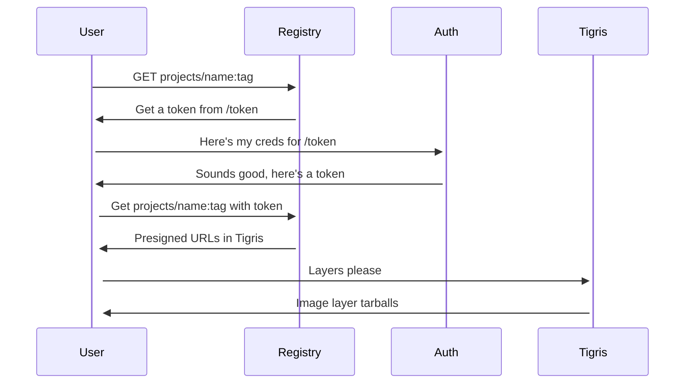

import InlineCta from "@site/src/components/InlineCta";

import heroimage from "./shipyards.webp";
import styles from "!!raw-loader!./styles.css";

<style>{styles}</style>


<center>
  <small>
    <em>
      A cartoon tiger unloading shipping containers from the back of a whale.
    </em>
  </small>
</center>

[Northflank](https://northflank.com/) is a full-stack cloud platform that makes
it easy to build, deploy and scale your code, jobs and databases. Run your
workloads on their cloud, or privately on yours. In order to make it easier for
you to deploy your applications privately, we’ve made a
[self-hostable Docker Registry](https://github.com/tigrisdata-community/self-hosted-docker-registry)
example that lets you store all your container images in Tigris. Hosting your
own docker registry lets you fully control your destiny and make your private
applications truly private.

To get started,
[open the stack template on Northflank](https://app.northflank.com/s/account/templates/stack-templates/deploy-tigris-registry).
The rest of this article is going to explain the moving parts in this template
and how they all work together.

## Why host your own Docker registry?

In the modern cloud, you deploy your applications in containers. Docker image
storage is normally cheap, but
[public registries have strict limits](https://docs.docker.com/docker-hub/usage/)
that can make deploying complicated applications difficult. Some registries
charge egress fees, meaning that your AI applications have hidden costs on every
deploy. Self-hosting your infrastructure means that you control your destiny.
You get to decide when things are deprecated. You control your path.

Northflank slots cleanly into this because they let you
[bring your own cloud](https://northflank.com/features/bring-your-own-cloud),
meaning that you can run your infrastructure in any region you want. Need to
deploy to one specific country for compliance reasons? Northflank has your back.
Spin up the cluster elsewhere and then give it over to the platform.

This example uses the open source
[CNCF Distribution](https://distribution.github.io/distribution/) project backed
by Tigris for storage and also uses Tigris for authentication. This lets you
mint and track registry credentials using the same pane of glass you use to mint
and track storage credentials.

## The moving parts

In order to get this working, there’s a few moving parts:

- The registry backend itself: You run an unmodified copy of
  [CNCF Distribution](https://distribution.github.io/distribution/) that uses
  Tigris as its storage backend and is configured to use a separate
  authentication endpoint.
- The authentication endpoint: You run a copy of
  [our authentication endpoint](https://github.com/tigrisdata-community/self-hosted-docker-registry/blob/main/cmd/anu/main.go)
  that takes user credentials and emits signed JSON Web Tokens (JWTs). CNCF
  Distribution uses these tokens to verify authentication and access control
  lists.
- A signing keypair: The authentication endpoint and CNCF Distribution need to
  have an RSA keypair so that the registry can validate the tokens signed by the
  authentication endpoint.

This adds up to two Northflank services like this:



## Setting it up

To set it up for yourself:

- Sign up for a Northflank account if you don’t have one already
- Sign up for a Tigris account and create a bucket
- Create an authkey with editor permissions on that bucket
- Open the template on Northflank:
  [https://app.northflank.com/s/account/templates/stack-templates/deploy-tigris-registry](https://app.northflank.com/s/account/templates/stack-templates/deploy-tigris-registry)
- Copy the bucket name into BUCKET_NAME
- Copy the access key ID into ACCESS_KEY
- Copy the secret access key into SECRET_KEY
- Follow the rest of the instructions to generate the right secret keys for the
  registry

:::note

The following instructions only work on macOS or a Linux environment. If you are
reading this from a Windows machine, please consider using the Windows Subsystem
for Linux (WSL). It is _possible_ to generate a TLS keypair in PowerShell, but I
do not recommend it.

:::

On your laptop, make a new folder in your terminal app of choice and run this
command:

```text
openssl \
  req -x509 -nodes -new \
  -sha256 -days 36500 \
  -newkey rsa:4096 \
  -keyout registry.key \
  -out registry.pem \
  -subj "/C=US/CN=Registry Auth CA"
```

Copy `registry.key` in base64 into `CERT_KEY`:

```text
cat registry.key | base64 -w0 | pbcopy
```

Copy `registry.pem` in base64 into `CERT_FILE`:

```text
cat registry.pem | base64 -w0 | pbcopy
```

:::note

If you are using desktop Linux, you may need to use `xclip` or `wl-copy` instead
of `pbcopy`.

:::

That’s it! It’s all ready to go!

### Using your new registry

Once you have this set up, make a new access key in the Tigris console and don’t
grant it any permissions. This will be how you log into your registry.

Download an example docker image such as `alpine:edge`:

```text
docker pull alpine:edge
```

Then tag it after the registry you made:

```text
docker tag alpine:edge http--registry--5yk6bhbvjh58.code.run/base/alpine:edge
```

Authenticate to the docker registry:

```text
docker login http--registry--5yk6bhbvjh58.code.run -u tid_access_key_id
```

Your password is the secret access key you just generated. Now push it to the
registry:

```text
docker push http--registry--5yk6bhbvjh58.code.run/base/alpine:edge
```

Then on another computer log into that registry with the same access key ID and
secret access key. Try to use the image you just created:

```text
$ docker run \
  --rm -it \
  http--registry--5yk6bhbvjh58.code.run/base/alpine:edge \
  cat /etc/os-release

NAME="Alpine Linux"
ID=alpine
VERSION_ID=3.22.0_alpha20250108
PRETTY_NAME="Alpine Linux edge"
HOME_URL="https://alpinelinux.org/"
BUG_REPORT_URL="https://gitlab.alpinelinux.org/alpine/aports/-/issues"
```

And that’s it! You have your own private registry stored in a Tigris bucket,
hosted on Northflank. From here you can also set up
[object lifecycle rules](https://www.tigrisdata.com/docs/buckets/object-lifecycle-rules/#configuring-an-object-lifecycle-rule)
to make old images move to Archive Instant Retrieval to save money. Personally I
have things move to the Archive Instant Retrieval tier after 90 days.

If you want to set this up for yourself outside of Northflank, check out the
[installation instructions](https://github.com/tigrisdata-community/self-hosted-docker-registry?tab=readme-ov-file#deploying-on-kubernetes)
on the GitHub repo. Or, even easier, 1-click it into existence with a Northflank
stack.

<InlineCta
  title="Unlimited storage; no egress fees"
  subtitle={
    "Need to store terabytes of data everywhere? Tigris has you covered without any pesky egress fees. Try it today and get the first 5 gigabytes on us. We'll store it everywhere out of the box."
  }
  button="Find out more"
/>
