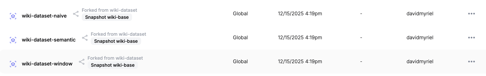
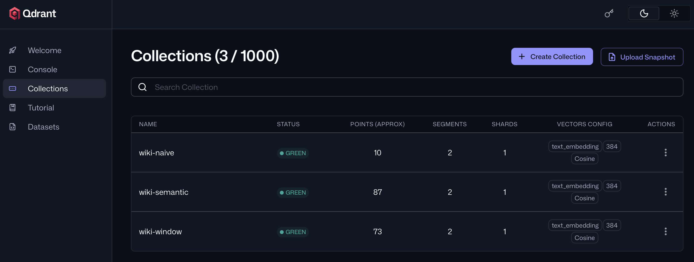
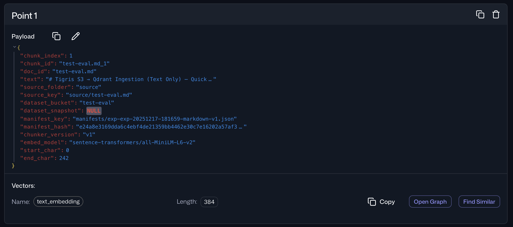
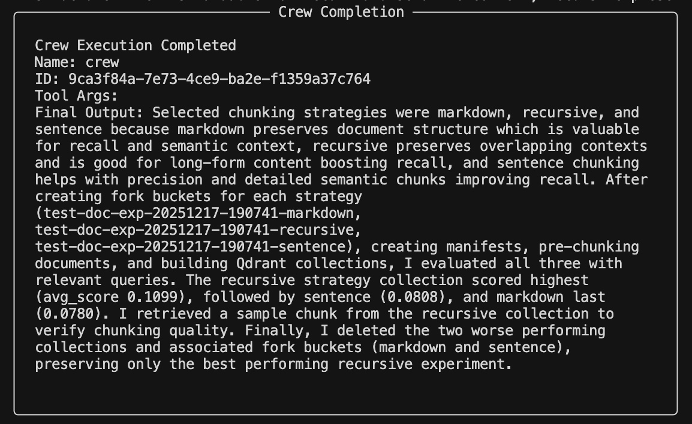

import heroimage from "./image1.png";
import InlineCta from "@site/src/components/InlineCta";


*"Did you chunk your documents properly?"* 

That's the first thing people ask when your retrieval misses.

When testing these methods, you need a way to run competing dataset experiments in parallel. This can get messy as you test dozens of strategies. But you really only need to keep the one that wins.

We built [**a small Python app**](https://github.com/davidmyriel/tigris-rag-lab) to help you discover the optimal chunking strategy without manual testing or guesswork. The evaluation automatically compares multiple strategies: paragraph, sentence, markdown, recursive, window, none - and ranks them using objective span-based metrics.

Of course, the secret sauce is [Tigris bucket forking](/fork-buckets-like-code/): an instant, isolated copy of a bucket (seeded from a snapshot) so experiments don't mutate the same underlying dataset state.  

> Note: To run [The Tigris RAG Lab](https://github.com/davidmyriel/tigris-rag-lab), you will need an API keys from [Tigris Data](https://www.tigrisdata.com), [Qdrant Vector Database](https://qdrant.tech) and [OpenAI](https://openai.com/index/openai-api/) for generation. We also use [CrewAI](https://www.crewai.com) to orchestrate agent operations.


### Why is chunking a big deal?

When you split up the same content in two different ways, the chunks can become vastly different vectors.
Since vector search runs some type of [euclidean/dot product/cosine distance](https://qdrant.tech/documentation/concepts/search/), calculating different vector arrays will result in greater or smaller distances.

This means that if you cut the paragraph at the wrong spot, it may be seen as semantically less relevant. The retriever may miss the broader rationale or cross‑sentence evidence. This hurts recall and makes the LLM hallucinate to fill gaps.

### **Why forking helps this experiment**

Dataset quality work is rarely one-dimensional. "Better" might mean higher groundedness, or answer relevance, lower hallucination rate or more consistent retrieval. The problem is that most dataset iteration workflows are destructive:

* You tweak chunking → but then you overwrite the artifact  
* You rerun ingestion → which replaces the prior index state  
* You try to reproduce results → and realize you can't

Forking fixes that by turning dataset experimentation into a first-class workflow primitive: **each hypothesis gets its own bucket namespace.**

No "did I overwrite the last run?" anxiety. No weird cross-contamination. Just clean bucket forks.

### **Version control built directly into object storage**

A Tigris bucket fork is a new bucket that starts from an existing bucket's state at a specific point in time, then evolves independently. From that moment on, anything you write or delete in the fork is isolated, and the original bucket stays untouched.

A fork can be created fast even for very large datasets because it is a **zero-copy** operation at creation time. Tigris does not duplicate all objects up front—instead it clones the bucket's metadata, so unchanged objects are effectively shared and only differences created after the fork require additional storage.

**Figure 1:** For each tested dataset, you can have a separate bucket with different chunks.



Forks also work cleanly with snapshots. You can fork from the bucket's current state or from a named snapshot, which makes experiments reproducible. If you're doing evaluation-driven dataset improvement, that maps perfectly to how you already think about iteration:

* **snapshot** = "baseline state I trust"  
* **fork** = "test storage for an experiment"  
* **keep fork** = "retain the best result"  
* **delete fork** = "discard the losers"

### **Orchestration via CrewAI** 

In this app, [CrewAI](https://www.crewai.com/) is easy because it turns the whole experiment loop into one clear workflow instead of a pile of glue code. 

> If you want to dig into how agents, tasks, and tools are modeled, the [CrewAI documentation](https://docs.crewai.com/) walks through the core concepts and examples. The [Streamlit](https://streamlit.io) UI collects the input, then CrewAI runs the same sequence for each chunking strategy:   

1. create a Tigris bucket fork, generate the chunked artifacts in that fork,   
2. build a matching Qdrant collection,   
3. run the span based evaluation,  
4. keep the fork that scores best and delete the rest. 

With CrewAI, you define the steps once, expose reliable tools for each step, and the agents repeat the loop consistently across strategies, which matches the app's "pick strategies, fork, index, evaluate, keep winner" design.  

This is what turns the app into a repeatable "dataset quality lab" instead of a one-off chunking script.

That's the whole game: bucket forks become the *unit of experimentation*.

### **Vector indexing and search with Qdrant**

Downstream, each fork's chunk output becomes its own Qdrant collection, giving you a clean 1:1 mapping. 

> For details on collections, payload schemas, and search parameters, see the [Qdrant documentation](https://qdrant.tech/documentation/):

* **bucket fork** = experiment artifact namespace  
* **Qdrant collection** = experiment retrieval behavior

That matters because it keeps comparisons fair: no shared index state, no accidental reuse of embeddings, no "it improved because the cache was warm" confusion.

**Figure 2:** Top K evaluation using vector search is run using Qdrant vector database. Each experiment tests recall using the vector index.



Each fork contains the dataset artifacts for exactly one hypothesis (one chunking strategy). That means when you later look at results you can say:

*"This score came from *that* fork, built from *that* chunking strategy, against *that* indexed collection."*

**Figure 3:** There's no ambiguity because each vector carries a metadata manifest with it. 



### **Evaluation logic to test chunking**

Our span-based evaluation directly measures chunk boundary quality by checking whether retrieved chunks overlap the gold answer spans. For each test question, the system:

1. queries the [Qdrant](https://qdrant.tech/) collection  
2. retrieves the **top-k chunks**  
3. checks whether each returned chunk's character range **overlaps** any gold span  
4. computes metrics across the ranked results: hit rate, MRR, coverage and redundancy.

This makes boundary failures painfully visible: when a strategy splits answers across chunks, you'll see coverage drop (and sometimes redundancy rise as the system "hunts" around the boundary).
Why are we doing this? Span metrics don't just say "retrieval good/bad." They explain *why*:

* **Coverage@k** tells you whether you're retrieving complete answers or fragments.  
* **Redundancy@k** tells you whether you're wasting top-k slots on overlapping chunks.  
* **MRR@k** tells you how quickly the system finds the answer span (ranking quality as experienced by the model).

Aggregated over many queries, you get a clear ranking of strategies for *your* document type and use case.

### **How to think about the workflow**

Here's the mental model:

```bash
baseline bucket  
   |  
   |-- fork: strategy\_A  -> artifacts\_A -> index\_A -> eval score\_A  
   |-- fork: strategy\_B  -> artifacts\_B -> index\_B -> eval score\_B  
   |-- fork: strategy\_C  -> artifacts\_C -> index\_C -> eval score\_C  
   |  
select max(score\_\*)  
keep that fork  
delete the rest
```

The fork is the "experiment container." The evaluation score is the "CI check." And the "deployment" is simply: keep the winning fork around.

**Figure 4:** The CrewAI Analysis Agent concludes the procedure by outlining which chunking strategies were used and why the high performing one was chosen.



### **Why using forks beats "just storing results somewhere"**

You could store eval results in a table, sure. However, forks let you preserve *the entire winning state*, not just a number:

* the exact pre-chunked documents  
* the exact inputs used for ingestion  
* the exact derived artifacts you want to reuse  
* the provenance needed to reproduce the run

That's the difference between:

* "Strategy B scored 0.71"  
  and  
* "Here is Strategy B's exact dataset variant, ready to be reused or promoted."

### **Try it out!**

Snapshots are great for safety and reproducibility. Forks are what make dataset iteration *practical*.
Tigris bucket forking is great for developers who need feature branches. 

You can isolate experiments, run them cleanly, and then keep the branch that actually shipped the best behavior.
If you're serious about document chunking, check out the [Tigris RAG Lab](https://github.com/davidmyriel/tigris-rag-lab) …and you'll never have to wonder which dataset variant your "best score" came from again.

<InlineCta
  title="Unlimited storage; no egress fees"
  subtitle={
    "Need to store terabytes of data everywhere? Tigris has you covered without any pesky egress fees. Try it today and get the first 5 gigabytes on us. We'll store it everywhere out of the box."
  }
  button="Find out more"
/>

