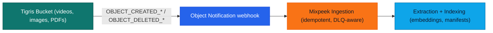
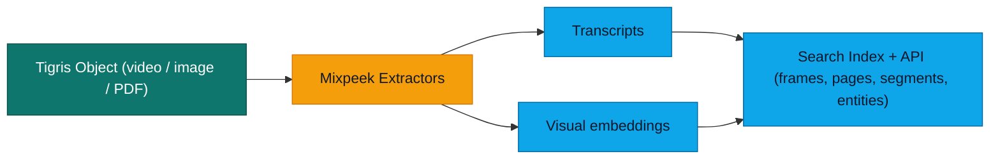

import InlineCta from "@site/src/components/InlineCta";
import MermaidFrame from "@site/src/components/MermaidFrame";
import PullQuote from "@site/src/components/PullQuote";
import creationGif from "./creation.gif";
import heroImage from "./hero-img.webp";


Most AI search tools handle text well until you throw a video, an audio
recording, or a scanned PDF at them. You have a bucket full of that kind of
content. How do you make it searchable without building and maintaining your own
polling pipeline?

That's the problem [Mixpeek](https://mixpeek.com/) solves. It's a multimodal
intelligence layer that sits on top of your object storage, turning raw
unstructured media into searchable, classifiable, and retrievable features
without you having to build the pipeline yourself. When you connect it to
[Tigris](https://www.tigrisdata.com/), the whole thing becomes event-driven from
the moment an object lands in your bucket.

<div style={{ maxWidth: "42rem", margin: "1.5rem auto" }}>
  <iframe
    width="560"
    height="315"
    src="https://www.youtube.com/embed/2GLkl8NnqcY?si=XY8AApiHEFXP4clA"
    title="YouTube video player"
    frameBorder="0"
    allow="accelerometer; autoplay; clipboard-write; encrypted-media; gyroscope; picture-in-picture; web-share"
    referrerPolicy="strict-origin-when-cross-origin"
    allowFullScreen
    style={{ width: "100%", height: "315px", display: "block" }}
  />
</div>

## Why Mixpeek chose Tigris as the storage layer

[Tigris](https://www.tigrisdata.com/) is a globally distributed, multi-cloud
object storage service with built-in support for the S3 API. Because it speaks
the S3 API natively, connecting Mixpeek is straightforward. It uses standard
IAM-style credentials, the same SDKs you're already using, just a different
endpoint. You can read more in the
[Tigris overview](https://www.tigrisdata.com/docs/overview/).

S3 compatibility is just the baseline. When Mixpeek processes your files, it
doesn't just read each object once. It makes repeated requests during
extraction: reading video in segments, pulling document pages, fetching image
data at different resolutions. With S3, each of those reads adds up in both
latency and cost.

Because Mixpeek uses Tigris as the storage layer, your files are read from the
region closest to the processing node running the extraction job. Latency stays
low regardless of where your users are uploading from. And with no egress fees,
Mixpeek can read your objects as many times as the pipeline needs without the
cost model working against you.

Here is how Tigris maps directly onto Mixpeek’s requirements:

| What Tigris provides    | Why it matters for Mixpeek users                                              |
| ----------------------- | ----------------------------------------------------------------------------- |
| **Global distribution** | Extraction jobs read files from the nearest region, keeping latency low       |
| **Zero egress fees**    | Repeated reads during processing don't accumulate transfer costs              |
| **S3 compatibility**    | No migration needed. Connect with existing AWS SDKs and credentials           |
| **Strong consistency**  | Every read reflects the latest write, so processing never works on stale data |

## How Mixpeek connects to your Tigris bucket

Connecting Mixpeek to Tigris follows the same S3-compatible authentication
pattern. You grant Mixpeek read access to your bucket using standard IAM-style
credentials, and Mixpeek uses those to discover and retrieve objects for
processing.

The GIF below shows the end-to-end flow in the Mixpeek dashboard:

<div style={{ maxWidth: "42rem", margin: "1.5rem auto" }}>
  
</div>

Once connected, Mixpeek runs an initial sync to backfill existing objects in the
bucket. From that point on, it processes new objects incrementally rather than
re-scanning the entire bucket on each run. You can also scope ingestion to a
specific prefix if you only want Mixpeek watching part of your bucket. For
details on working with buckets, see the
[Tigris bucket docs](https://www.tigrisdata.com/docs/buckets/create-bucket/).

At a high level, the control plane looks like this:

<MermaidFrame title="Tigris object events flow into Mixpeek, which ingests and indexes each change.">



</MermaidFrame>

## How Mixpeek turns files into searchable layers

When a file hits a Mixpeek-connected bucket, it gets broken into layers:
transcripts, visual embeddings, scene descriptions, and detected entities. Each
of those layers is independently queryable.

For video, that means frame-accurate retrieval. Search for "person writing on
whiteboard" and you get back the exact timestamp, not just the file name. The
pipeline handles video, images, audio, and PDFs through the same unified API.

Here's what that looks like in practice. Say a property management company
uploads walkthrough videos of new listings every day. With Mixpeek and Tigris,
each walkthrough is automatically broken into room-level segments the moment it
lands in the bucket. An agent can search "kitchen with granite countertops" and
get back the exact timestamp in the exact video — across thousands of hours of
footage. No polling delay, no manual tagging.

The same pattern works for media companies indexing footage libraries, edtech
platforms making lecture recordings searchable, or compliance teams flagging
documents on arrival.

Conceptually, the data path is:

<MermaidFrame title="Mixpeek breaks each Tigris object into transcripts, visual features, and an index you can query.">



</MermaidFrame>

And here's what the query looks like once your media is indexed:

```python
results = mixpeek.search(
    query="person writing on whiteboard",
    modalities=["video", "image"],
    filters={"bucket": "my-media-bucket"}
)

# => [{"file_key": "videos/interview-2025.mp4", "timestamp": "00:02:14", "score": 0.94}, ...]
```

## Why polling-based ingestion does not scale

Building this kind of ingestion pipeline yourself means solving a lot of boring,
hard problems before you get to the interesting ones. How do you know when a new
file arrives? How do you avoid processing the same file twice? What happens when
a job fails mid-extraction?

Without event notifications, most integrations fall back to periodic
list-and-diff polling. You scan the bucket on a schedule, compare against what
you've already processed, and queue up the new objects.

This works for small, low-volume buckets. Once you have millions of objects and
steady traffic, the tradeoffs get sharp:

| Problem              | What happens in a polling pipeline                                                                                                                |
| -------------------- | ------------------------------------------------------------------------------------------------------------------------------------------------- |
| **Indexing lag**     | A 5-minute poll interval means the index is always 0–5 minutes behind writes. Tighter schedules increase list calls and hit rate limits.          |
| **Wasted reads**     | Most polls re-scan keys that have not changed, burning API calls, bandwidth, and CPU just to learn that nothing happened.                         |
| **Failure recovery** | If a polling run crashes halfway through, you need durable checkpoints to avoid either missing objects or reprocessing large parts of the bucket. |
| **Thundering herds** | During an upload spike, every poll returns huge diffs at once. Downstream workers see sawtooth loads instead of a smooth stream of events.        |

At scale, a missed cycle can leave your index stale for minutes or longer. A
noisy neighbor workload or a transient 500 from your cloud provider is all it
takes.

## How Tigris Object Notifications replace polling

[Tigris Object Notifications](https://www.tigrisdata.com/docs/buckets/object-notifications/)
flip the model from pull to push. When an object is created, updated, or
deleted, Tigris fires an HTTP POST to your configured webhook endpoint
immediately.

You set this up once in the
[Tigris Dashboard](https://console.tigris.dev/signin) under bucket settings. No
polling loop. No scheduled scans. Mixpeek's ingestion endpoint receives the
event and kicks off processing as soon as the object exists.

Here is a simplified example of the payload Mixpeek receives:

```json
{
  "eventType": "OBJECT_CREATED_PUT",
  "bucket": "my-media-bucket",
  "key": "videos/interview-2025.mp4",
  "size": 104857600,
  "lastModified": "2025-03-02T10:45:00Z",
  "etag": "abc123def456"
}
```

You can also filter which events hit your webhook using Tigris's SQL-like
metadata querying, so you only trigger processing for the object types your
pipeline actually needs.

## How Mixpeek handles bursty uploads safely

Event-driven pipelines need failure handling built in. Mixpeek covers the
operational pieces that most teams have to build themselves.

The table below summarizes the key reliability features in the ingestion layer:

| Reliability feature      | What it does                                                                                 |
| ------------------------ | -------------------------------------------------------------------------------------------- |
| **Dead Letter Queue**    | Retries failed objects up to 3 times, then quarantines them instead of blocking the pipeline |
| **Idempotent ingestion** | Deduplicates by bucket + source + object identity, so retries never double-process           |
| **Distributed locking**  | Prevents concurrent sync runs from colliding during bursty event storms                      |
| **Rate-limit backoff**   | Automatic 429 handling to smooth spikes without dropping events                              |
| **Metrics**              | Duration, batch counts, failure rates, and DLQ depth all exposed for ops visibility          |

A burst of uploads shouldn't cause your pipeline to process the same file four
times or deadlock on concurrent runs. These safeguards make sure it doesn't.

## Access patterns once your media is indexed

Search is one access pattern, but it's not the only one. A few of the common
access patterns look like this:

| Access pattern        | What it means                                                  |
| --------------------- | -------------------------------------------------------------- |
| **Retrieval**         | Semantic search across video frames, audio segments, PDF pages |
| **Classification**    | Auto-tag objects by content, entity, or visual category        |
| **Clustering**        | Group similar assets, surface duplicates, find dataset gaps    |
| **Anomaly detection** | Flag out-of-distribution objects as they arrive                |

All of this runs against the same indexed representation Mixpeek builds from
your Tigris bucket. You don't maintain separate pipelines for each access
pattern.

## Using your Tigris bucket as the system of record

Treat your Tigris bucket as the authoritative record of your dataset, not just a
place to dump files. Mixpeek writes structured outputs (JSON metadata, derived
segments, embeddings) that map back to a stable object identity in Tigris:
bucket + key + ETag. If you need to reproduce a result, the lineage is there.

```json
{
  "source": {
    "bucket": "my-media-bucket",
    "key": "videos/interview-2025.mp4",
    "etag": "abc123def456"
  },
  "segments": [
    {
      "timestamp": "00:02:14",
      "text": "person writing on whiteboard",
      "score": 0.94
    },
    {
      "timestamp": "00:05:41",
      "text": "diagram of system architecture",
      "score": 0.87
    }
  ]
}
```

Pair this with
[Tigris snapshots](https://www.tigrisdata.com/blog/fork-buckets-like-code/) and
you get point-in-time reproducibility without managing a separate versioning
system. If an experiment goes sideways, fork from a known-good snapshot and
replay processing against that state. To start using snapshots in your own
buckets, follow the
[snapshot how-to guide](https://www.tigrisdata.com/docs/buckets/snapshots-and-forks/).

## End-to-end flow from upload to query

```mermaid
graph LR
  A["Write object to Tigris (S3-compatible upload)"]
    --> B["Tigris Object Notification webhook"]
  B --> C["Mixpeek receives event and checks idempotency key"]
  C --> D["Extraction job (transcript, embeddings, entities)"]
  D --> E["Results queryable in Mixpeek"]
  E --> F["Derived artifacts written back to Tigris"]

  classDef stepUpload fill:#0f766e,stroke:#0b4f4a,color:#ffffff;
  classDef stepNotify fill:#2563eb,stroke:#1d4ed8,color:#ffffff;
  classDef stepProcess fill:#f97316,stroke:#ea580c,color:#111827;
  classDef stepResult fill:#0ea5e9,stroke:#0369a1,color:#0f172a;

  class A stepUpload;
  class B stepNotify;
  class C,D stepProcess;
  class E,F stepResult;
```

<MermaidFrame title="An object upload triggers a notification, Mixpeek processes it, and the results become queryable.">



</MermaidFrame>

Each step is independently observable. You can monitor DLQ depth and batch
metrics, and replay any event that was missed during an outage using Mixpeek's
reconciliation scan.

## Try it yourself

Connect your Tigris bucket to Mixpeek using the
[Mixpeek integrations guide](https://mixpeek.com/docs/integrations/object-storage/tigris).
Configure Object Notifications in your
[Tigris Dashboard](https://console.tigris.dev/signin), point the webhook at
Mixpeek's ingestion endpoint, and your pipeline is live. Mixpeek's free tier
lets you index your first objects at no cost — enough to test the full pipeline
end to end before committing to production volume.

Here's the quick version:

```python
import boto3

# 1. Upload to your Tigris bucket
s3 = boto3.client(
    "s3",
    endpoint_url="https://fly.storage.tigris.dev",
    aws_access_key_id="YOUR_TIGRIS_KEY",
    aws_secret_access_key="YOUR_TIGRIS_SECRET",
    region_name="auto",
)
s3.upload_file("demo-video.mp4", "my-media-bucket", "videos/demo.mp4")

# 2. Tigris fires the notification to Mixpeek automatically

# 3. Query the result
import mixpeek
results = mixpeek.search(query="diagram of system architecture")
print(results[0]["timestamp"], results[0]["score"])
# "00:05:41" 0.87
```

No polling. No stale indexes. Just push-based processing from the moment your
media hits storage.

## Conclusion: event-driven ingestion without polling

Mixpeek and Tigris work best when you treat object notifications as the nervous
system of your multimodal stack. Tigris handles globally distributed,
low-latency object storage and push-based delivery of every change event.
Mixpeek turns those events into transcripts, embeddings, and manifests you can
query in one place.

If you're still polling buckets on a schedule, this is your path off the cron
wheel: wire up notifications once, point them at Mixpeek, and let the pipeline
keep your index fresh while you focus on what to build with it.

<PullQuote>
  Mixpeek's free tier lets you start indexing your media in minutes. Connect
  your Tigris bucket and try Mixpeek today:{" "}
  <a href="https://mixpeek.com/docs/integrations/object-storage/tigris">
    Mixpeek Tigris integration guide
  </a>
</PullQuote>

<InlineCta
  title="Unlimited storage; no egress fees"
  subtitle={
    "Need to store terabytes of multimodal data everywhere? Tigris has you covered without any pesky egress fees. Try it today and get the first 5 gigabytes on us."
  }
  button="Get started with Tigris"
  link="https://www.tigrisdata.com/docs/buckets/object-notifications/"
/>
