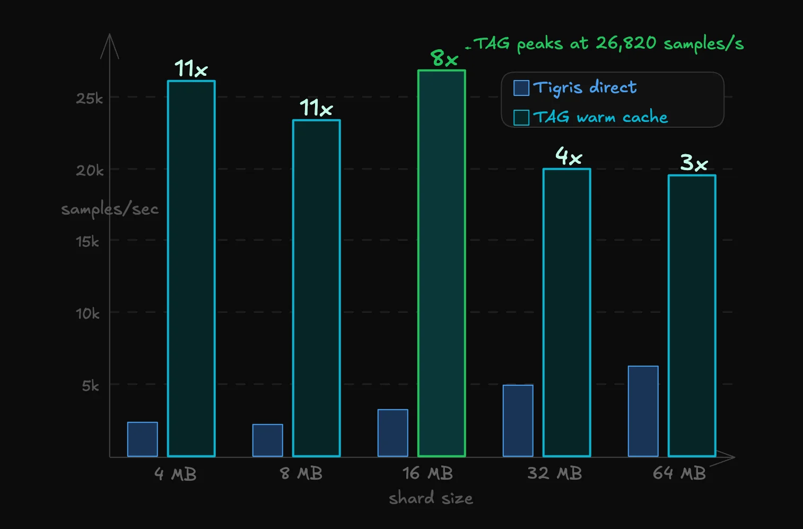
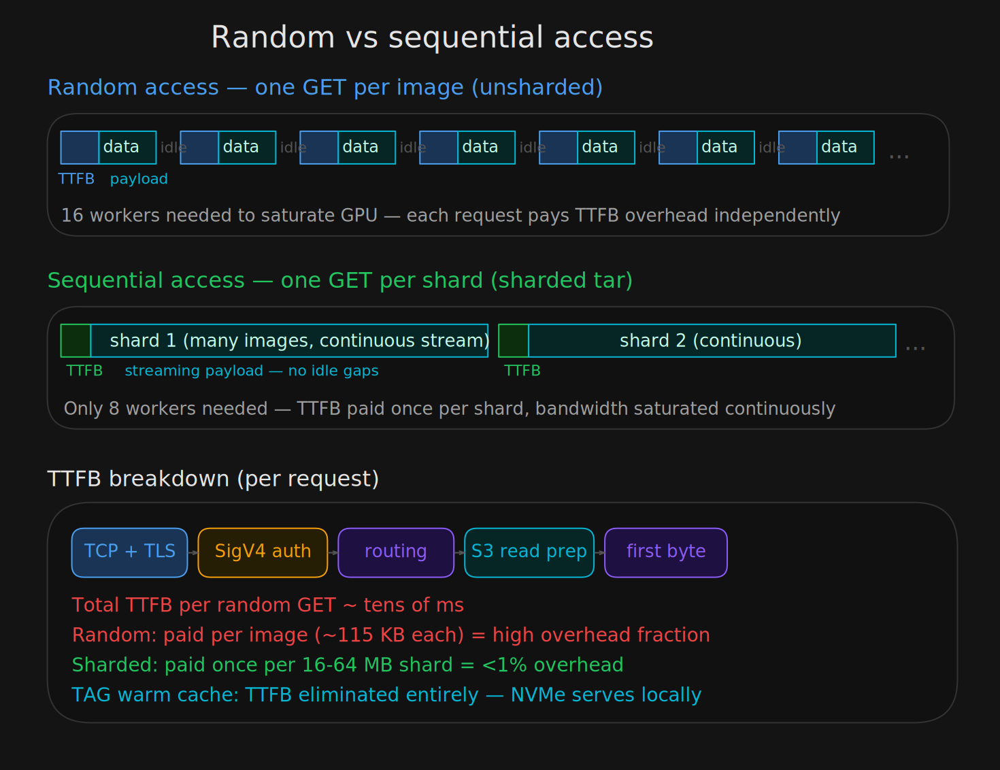
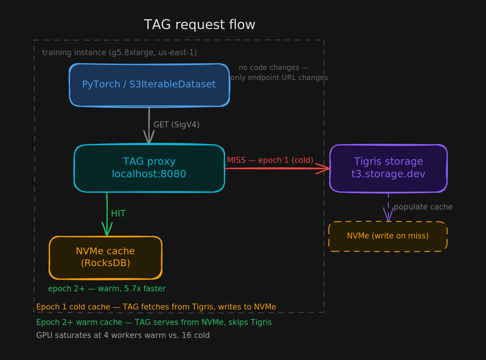
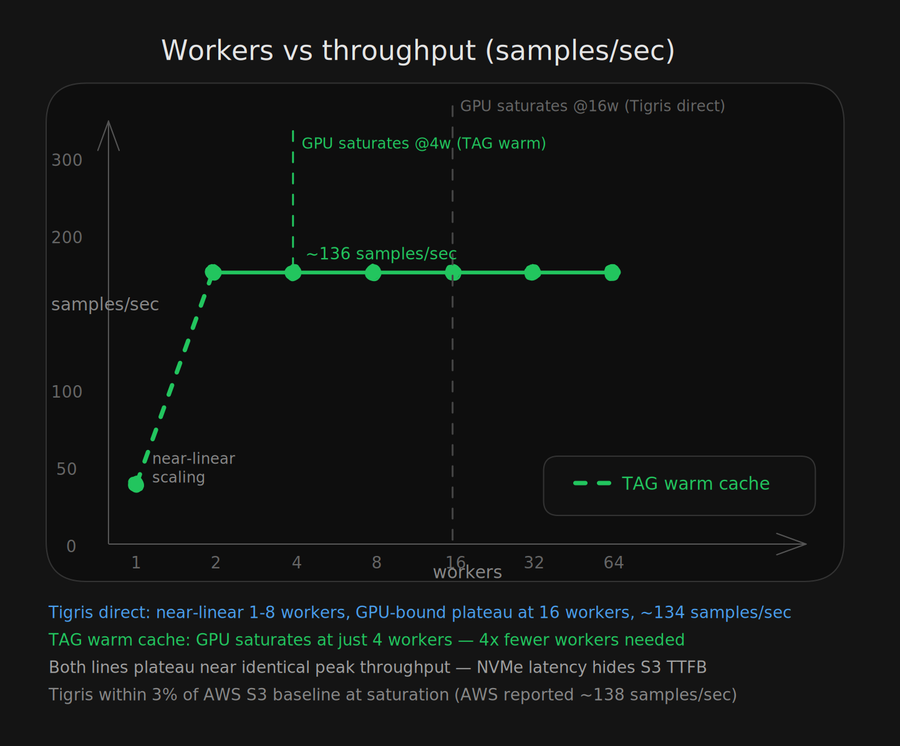
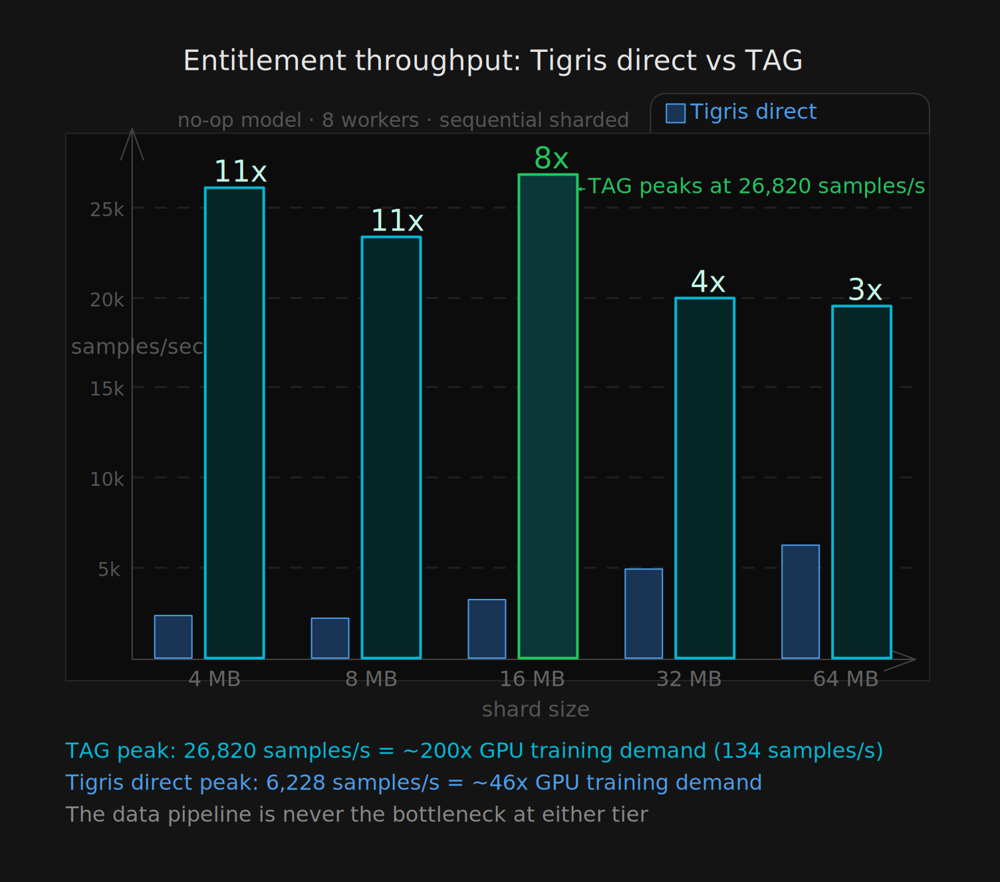

# Benchmarking ML Training Throughput on Tigris Object Storage

In December 2025, AWS published a
[benchmark](https://aws.amazon.com/blogs/machine-learning/applying-data-loading-best-practices-for-ml-training-with-amazon-s3-clients/)
demonstrating that with the right access patterns and client tooling, you can
train ML models directly from S3 without starving the GPU. We replicated that
benchmark against Tigris, and then extended it with a component we've been
building: the Tigris Acceleration Gateway (TAG), a local S3-compatible caching
service that runs on the training instance. Tigris delivers similar throughput
to AWS S3 on the same workload; TAG's local NVMe cache reduces warm-epoch
duration by 5.7x and cuts the workers required to saturate the GPU from 16 to 4.

This post covers the methodology, results, and what they imply for data pipeline
design. We start with the fundamentals of why data loading becomes a bottleneck
in object storage workloads, then walk through each benchmark in sequence:
building from single-epoch results to multi-epoch caching with TAG, and finally
to an entitlement benchmark that removes the GPU from the equation entirely to
measure the raw throughput ceiling of the data pipeline. That last benchmark
shows Tigris delivering samples at 46x the rate the GPU can consume them, and
TAG at ~200x, confirming that a correctly configured S3-native pipeline is never
the bottleneck.

## Background: why data loading is a bottleneck

A standard ML training loop has four stages: reading samples from storage,
preprocessing on CPU, computing gradient updates on GPU, and writing
checkpoints. The effective throughput of the pipeline is constrained by the
slowest stage. In cloud environments where compute and storage are decoupled,
the data loading stage (not the GPU) is often the limiting factor.

The root cause in object storage workloads is the latency of individual
requests. Each S3 GET request incurs a time-to-first-byte (TTFB) overhead that
is largely independent of object size. When a dataset consists of many small
files (one S3 object per training sample), the dataloader spends most of its
time blocked on TTFB rather than transferring data. This is a latency-bound
regime. Increasing the number of dataloader workers increases parallelism and
can compensate. The goal is to keep enough requests in flight that the GPU stays
fed despite per-request latency.

The alternative is to consolidate training samples into larger tar shards. A
single GET request then streams many samples sequentially, amortizing
per-request overhead and shifting the workload into a bandwidth-bound regime.
Sequential access also enables predictive prefetching, since the next batch of
samples can be anticipated and buffered while the current batch is being
processed.

_Figure: random access is latency-bound with one GET per sample; sequential
access is bandwidth-bound with one GET per shard._

These are the two access patterns we benchmarked: random (unsharded) and
sequential (sharded). The benchmark was configured as follows.

## Benchmark setup

We used our
[fork of the AWS S3 Connector for PyTorch](https://github.com/tigrisdata/s3-connector-for-pytorch),
which extends the upstream benchmarking tool to accept a custom S3-compatible
endpoint URL, making it possible to run the exact same benchmark suite against
any S3-compatible storage, not just AWS S3. All other benchmark logic is
unchanged from the AWS reference implementation.

- **Instance:** g5.8xlarge (NVIDIA A10G GPU, 32 vCPUs, 128 GB RAM), us-east-1
- **Dataset:** 100,000 JPEG images, ~115 KB each, ~10 GB total; sharded variants
  packed into tar archives at 4-256 MB shard sizes
- **Dataloader:** `S3IterableDataset` from the S3 Connector for PyTorch,
  `s3reader.type: sequential`
- **Models:** ViT (Vision Transformer) for GPU-bound benchmarks; no-op
  entitlement model for throughput ceiling benchmarks
- **Storage targets:**
  - Tigris: `t3.storage.dev`
  - TAG: NVMe-backed local caching service on the same instance
- **Metrics:** samples/sec derived from throughput (MiB/s) normalized by mean
  image size (~115 KB); GPU utilization and CPU memory from instance monitoring

## Part 1: Random access — Tigris throughput scales near-linearly to 16 workers, where the GPU saturates at ~134 samples/sec

We will do the hardest case first. Random access means one S3 GET per training
sample. The question is how many dataloader workers are needed before the GPU,
not the network, becomes the bottleneck.

Dataset: 100k unsharded JPEG images, one S3 object per sample. Single epoch.
Worker count swept from 1 to 64.

| Workers | Samples/sec | Duration (s) | GPU Util (%) |
| ------: | ----------: | -----------: | -----------: |
|       1 |         ~12 |        8,557 |          8.7 |
|       2 |         ~23 |        4,321 |         17.0 |
|       4 |         ~46 |        2,171 |         33.7 |
|       8 |         ~93 |        1,072 |         68.0 |
|      16 |        ~134 |          746 |         98.0 |
|      32 |        ~134 |          746 |         98.1 |
|      64 |        ~134 |          747 |         98.1 |

Throughput scales near-linearly from 1-8 workers, each doubling of worker count
roughly doubles samples/sec. The curve flattens at 16 workers, where the GPU
reaches 98% utilization at ~134 samples/sec. Beyond 16 workers, additional
parallelism provides no throughput improvement; the bottleneck has shifted from
data loading to GPU compute.

For reference, the AWS benchmark on the same instance type with AWS S3 reported
~138 samples/sec at saturation. Tigris delivers ~134 samples/sec, within 3% of
AWS S3 on the same workload.

The random access benchmark establishes the baseline, but it also highlights the
cost of per-object TTFB at scale: 16 workers needed just to feed one GPU.
Packing images into tar shards might change that.

## Part 2: Sequential access (sharded) — GPU saturates at 8 workers regardless of shard size; sharding halves worker requirements versus random access

Packing images into tar shards lets the dataloader issue a single GET request
and stream many samples sequentially, shifting from latency-bound to
bandwidth-bound.

We swept shard sizes from 4 MB to 256 MB with a fixed set of 8 workers to
isolate the effect of access pattern from worker count.

Dataset: 100k images packed into tar shards ranging from 4 MB to 256 MB. Single
epoch. Fixed at 8 workers.

| Shard Size | Samples/sec | Duration (s) | GPU Util (%) |
| ---------: | ----------: | -----------: | -----------: |
|       4 MB |        ~134 |        736.6 |         99.2 |
|       8 MB |        ~134 |        736.1 |         99.3 |
|      16 MB |        ~134 |        736.3 |         99.3 |
|      32 MB |        ~135 |        735.0 |         99.4 |
|      64 MB |        ~134 |        736.6 |         99.4 |
|     128 MB |        ~134 |        737.1 |         99.3 |
|     256 MB |        ~133 |        739.1 |         99.2 |

From these results we can make two observations:

**Shard size has no meaningful impact on throughput.** Across the full 4 MB-256
MB range, samples/sec and GPU utilization are essentially flat (~133-135
samples/sec, ~99.3% GPU). The storage layer is not the bottleneck at any shard
size tested.

**Sequential access requires fewer workers to saturate the GPU.** The random
access benchmark needed 16 workers to reach ~134 samples/sec. The sharded
benchmark achieves the same throughput with 8 workers. Tar sharding reduces
per-object overhead sufficiently that half the worker parallelism is needed to
keep the GPU fed.

Both Part 1 and Part 2 are single-epoch benchmarks that measure steady-state
performance of training directly off object storage. Most real training jobs are
multi-epoch: the same dataset is iterated over many times. That changes the
calculus significantly, and that's where caching becomes relevant.

## Part 3: Multi-epoch training with TAG — warm-cache epochs complete 5.7x faster; GPU saturates at 4 workers versus 16 without caching

The results so far confirm that Tigris can keep a GPU fully saturated with the
right access pattern. But single-epoch throughput is only part of the story.
Training workloads iterate over the same dataset multiple times, often dozens or
hundreds of epochs. In that regime, every byte transferred from object storage
in epoch 1 will be transferred again in epoch 2, epoch 3, and so on, paying
network TTFB overhead repeatedly for data the instance has already seen.

This is the problem Tigris Acceleration Gateway (TAG) was built to solve.

TAG is an S3-compatible caching service that runs as a sidecar on the training
instance. It intercepts outbound S3 requests, serves cache hits from local NVMe,
and on a cache miss fetches from the upstream Tigris endpoint and populates the
cache. To the training process, it looks like an ordinary S3 endpoint. No
changes to training code are required beyond pointing the endpoint URL at
`localhost:8080` instead of `t3.storage.dev`.

_Figure: TAG request flow — epoch 1 populates NVMe from Tigris; epochs 2+ are
served entirely from local cache._

The first epoch is a cache warming pass: every object fetched from Tigris is
written to local NVMe as a side effect. Starting from the second epoch, all
reads are served locally. Network latency is no longer on the critical path.

We ran TAG in 3-epoch mode on the random-access (unsharded) dataset where each
of the 100k images is a separate S3 object with independent TTFB overhead on the
cold path. This configuration is also the practically relevant one: it
represents training directly on a dataset of raw images, stored as individual
objects in Tigris, with no preprocessing or tar packaging required.

| Workers | Total Duration (s) | Epoch 1 (s) | Epoch 2 (s) | Epoch 3 (s) | GPU Util (%) |
| ------: | -----------------: | ----------: | ----------: | ----------: | -----------: |
|       2 |              5,666 |       4,197 |         734 |         735 |         38.6 |
|       4 |              2,207 |       2,065 |         736 |         736 |         99.4 |
|      16 |              2,206 |         736 |         735 |         735 |         99.3 |

At 2 workers, Epoch 1 takes 4,197s (cold cache, fetching from Tigris over the
network). Epochs 2 and 3 each complete in ~734s, a **5.7x reduction** in epoch
duration from caching alone, with no changes to the training configuration.

More significantly: with a warm cache, **4 workers are sufficient to saturate
the GPU at 99.4% utilization**, compared to 16 workers required with direct
Tigris access. Local NVMe eliminates the network latency that necessitated
higher worker counts. At 4 and 16 workers, total duration and per-epoch times
are statistically identical (~736s/epoch), confirming the bottleneck is the GPU,
not the data pipeline.

_Figure: with a warm cache, 4 workers saturate the GPU that required 16 with
direct object storage access._

:::info

Warm-cache random access achieves the same GPU saturation as the sharded
sequential benchmark, at the same worker count, without any dataset
preprocessing. For multi-epoch workloads, TAG removes the need to pack data into
shards.

:::

Parts 1–3 show the data pipeline can keep the GPU fed. They do not reveal how
much margin exists in the data loading layer; the GPU saturates before the
storage layer is tested to its limit. To find that ceiling, we remove the GPU
from the equation entirely.

## Part 4: Entitlement benchmark — Tigris delivers samples at 46x GPU demand; TAG reaches ~200x at peak

The ViT results establish that the GPU is the bottleneck in a well-configured
pipeline. They do not reveal how much headroom exists in the data loading layer
itself. To measure the raw throughput ceiling (the maximum rate at which the
data pipeline can deliver samples), we replaced the ViT model with a no-op
entitlement model. This removes GPU processing entirely (GPU util = 0%) and
isolates the read-and-preprocess path.

### Tigris direct

8 workers, sequential sharded access, single epoch.

| Shard Size | Samples/sec | CPU Util mean (%) | CPU Util p90 (%) |
| ---------: | ----------: | ----------------: | ---------------: |
|       4 MB |       2,323 |               2.3 |              3.7 |
|       8 MB |       2,198 |               2.3 |              3.8 |
|      16 MB |       3,256 |               3.3 |              5.1 |
|      32 MB |       4,897 |               6.6 |             11.3 |
|      64 MB |       6,228 |               9.0 |             16.9 |

Throughput increases with shard size: 64 MB shards deliver 6,228 samples/sec,
approximately 2.7x faster than 4 MB shards. The driver is reduction in S3 GET
request count. Larger shards amortize per-request TTFB over more samples. CPU
utilization remains low across all configurations (mean 2-9%), confirming the
bottleneck is network I/O, not CPU processing capacity.

At 64 MB shards, Tigris is delivering samples at ~46x the rate the ViT model can
consume them (~135 samples/sec). The ViT sequential benchmark was GPU-bound at
every shard size tested. The storage layer had remaining headroom.

### TAG

Same configuration, data served from local NVMe cache.

| Shard Size | Samples/sec | CPU Util mean (%) | CPU Util p90 (%) |
| ---------: | ----------: | ----------------: | ---------------: |
|       4 MB |      26,078 |              30.0 |             33.4 |
|       8 MB |      23,323 |              31.8 |             36.5 |
|      16 MB |      26,820 |              39.5 |             46.5 |
|      32 MB |      19,965 |              41.2 |             66.6 |
|      64 MB |      19,483 |              49.3 |             91.3 |

TAG peaks at 26,820 samples/sec at 16 MB shards, approximately **200x the
throughput of the ViT training workload** and **~4x faster than Tigris direct**
at the same shard size.

_Figure: with data served from local NVMe, TAG delivers samples at ~200x the
rate the ViT model can consume them, and ~4x the throughput of Tigris direct at
the same shard size._

The throughput profile is inverted compared to Tigris direct: smaller shards
(4-16 MB) outperform larger ones. When data is served from local NVMe, the
per-request overhead of S3 GET calls is negligible. The bottleneck shifts to how
well work is parallelized across the 8 dataloader workers. Smaller shards
distribute more evenly. At 64 MB shards, CPU p90 reaches 91.3%. TAG shares the
instance CPU with the PyTorch workers, and at larger shard sizes the combined
load begins to constrain throughput.

With all four benchmarks complete, the results look like this.

## Summary

| Configuration                            | Workers | Epochs | Samples/sec | GPU Util (%) |
| :--------------------------------------- | ------: | -----: | ----------: | -----------: |
| Tigris direct, random access             |      16 |      1 |        ~134 |         98.0 |
| Tigris direct, sharded (any shard size)  |       8 |      1 |        ~134 |         99.3 |
| TAG, random access, warm cache           |       4 |    2-3 |        ~135 |         99.4 |
| TAG, entitlement, peak                   |       8 |      1 |      26,820 |            0 |
| Tigris direct, entitlement, 64 MB shards |       8 |      1 |       6,228 |            0 |

Key takeaways:

**Tigris matches AWS S3 throughput.** At saturation, Tigris delivers ~134
samples/sec on random-access data, within 3% of the ~138 samples/sec AWS
reported on the same instance type and workload.

**Sharding is more efficient than increasing worker count for single-epoch
Tigris direct workloads.** Sequential sharded access saturates the GPU at 8
workers; random access requires 16. Sharding reduces per-object overhead at the
storage layer, which is a more efficient use of resources than compensating with
additional worker parallelism. For multi-epoch workloads, however, TAG's warm
cache achieves the same result without packing data into shards.

**TAG's local cache reduces worker requirements, accelerates multi-epoch
training and eliminates the need to pack data into shards.** With a warm cache,
4 workers saturate the GPU that required 16 with direct object storage access.
Warm-cache epoch duration is 5.7x shorter than cold-cache at equivalent worker
count. TAG achieves this on a raw unsharded image dataset, training directly on
individual S3 objects, with no tar packaging or dataset preprocessing. For
workloads that iterate over the same data across multiple epochs, that removes
the need for sharding.

**The data pipeline is not the bottleneck in a well-configured setup.** The
entitlement benchmark shows Tigris can deliver samples at 46x the rate the ViT
model consumes them (at 64 MB shards). Through TAG, that headroom grows to
~200x. The ViT results were GPU-bound throughout. A correctly configured
S3-native pipeline keeps up with the GPU without requiring local data staging.

## Future work

The benchmarks in this post evaluate TAG in its current form: a S3-compatible
caching service with an NVMe-backed store, operating on read-heavy multi-epoch
workloads. Several directions are under active development:

- **Checkpoint acceleration.** Extending TAG to accelerate checkpoint write and
  read paths, which are write-heavy and latency-sensitive in a way that differs
  from training data access.
- **Prefetch-aware cache warming.** Allowing TAG to pre-populate the cache from
  a manifest before training begins, eliminating cold-epoch overhead entirely
  for workloads with known dataset composition.

This post covers image classification with ViT as the representative workload.
Subsequent posts in this series will evaluate TAG across additional training
workloads, including LLM fine-tuning, multimodal training, and distributed
training — where the access patterns and bottleneck characteristics differ
materially from the image classification case benchmarked here.

## About TAG

TAG is an S3-compatible caching service we've been building to eliminate the
need for manual data staging in ML training pipelines. It runs on the training
instance, intercepts S3 requests transparently, and serves a local NVMe cache
that is populated on first access and reused across subsequent epochs and
training runs. Training code requires no modification. The only change is the
endpoint URL.

We are working toward making TAG more broadly available. If you are running ML
training workloads and are interested in early access,
[reach out](mailto:help@tigrisdata.com).
