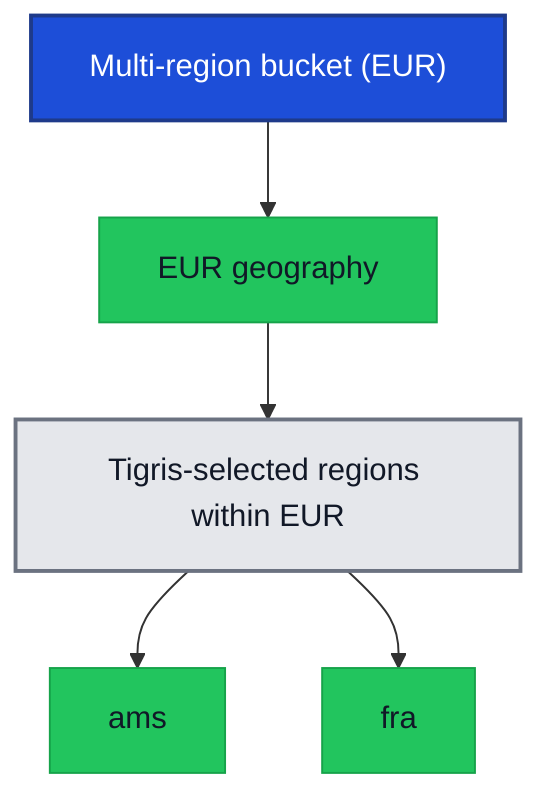
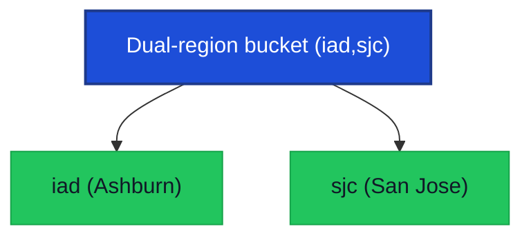
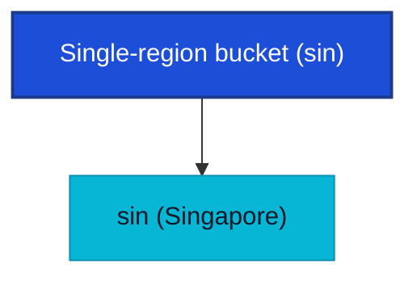

import InlineCta from "@site/src/components/InlineCta";
import QuickSummary from "@site/src/components/QuickSummary";
import BucketLocationDiagram from "@site/src/components/BucketLocationDiagram";
import DiagramFrame from "@site/src/components/DiagramFrame";
import heroImage from "./hero-img.webp";
import complianceImage from "./compliance.webp";
import globalImage from "./global.webp";


<QuickSummary
  readTime="6 min read"
  items={[
    {
      title: <a href="#global-buckets">Four location types.</a>,
      description:
        "Global, multi-region, dual-region, and single-region buckets cover the main combinations of data residency and availability.",
    },
    {
      title: <a href="#pricing">Simple pricing.</a>,
      description:
        "Multi-region is $0.025/GB/month with zero egress fees and no per-geo premiums, so your bill stays predictable even as you add regions.",
    },
    {
      title: <a href="#consistency-options">Clear consistency model.</a>,
      description:
        "Consistency is tied directly to bucket location type, so you always know how reads behave in and across regions.",
    },
    {
      title: <a href="#how-to-configure">CLI and dashboard updates.</a>,
      description:
        "Use the new tigris mk commands and updated dashboard flows to create and manage location-aware buckets.",
    },
  ]}
/>

Today, we're introducing
[bucket location types](https://www.tigrisdata.com/docs/buckets/locations/) in
Tigris. Going forward, there will be four ways to control exactly where your
data lives and how resilient it is.

Tigris has always distributed data globally. You write once, then read fast from
anywhere. That model works well for most workloads, but it left no room for
teams with constraints the automatic model could not accommodate.

- The first constraint is compliance. [GDPR](https://gdpr-info.eu/art-44-gdpr/),
  data sovereignty laws, and enterprise contracts can require that data never
  leaves a specific country or region. "Close to your users" doesn't satisfy a
  regulation that says Frankfurt or nothing.

- The second is architecture. Multi-tenant platforms, active/active deployments,
  and compute-co-located pipelines all need storage in a known location. When
  your system depends on a topology guarantee, automatic distribution works
  against you.

[**Multi-region and dual-region buckets are our answer to that gap.**](https://www.tigrisdata.com/docs/buckets/locations/)
Multi-region is the recommended default for most production workloads;
dual-region lets you name two specific regions when regulations or architecture
call for it. You can choose exactly where your data lives and how resilient it
needs to be across four location types:

<BucketLocationDiagram />

## Global buckets

<div style={{ maxWidth: "42rem", margin: "1.5rem auto" }}>
  
</div>

Global buckets are what Tigris has always done: data distributed worldwide,
reads served from the region closest to the request. They're now a first-class
location type you can select intentionally.

They're the right choice for read-heavy workloads with users spread across the
world: model weights, media libraries, static assets, documentation. You write
infrequently, you read everywhere, and Tigris handles the rest.

:::info Global endpoints

Tigris is deployed globally across multiple regions. All regions are accessible
via `https://t3.storage.dev` and `https://fly.storage.tigris.dev`, which handle
routing automatically. In your SDKs or the AWS CLI, set the region to `auto` and
Tigris takes care of the rest.

:::

## Multi-region buckets (recommended default)

**This is the place to start for most new production workloads.** Multi-region
buckets keep copies of your data across a group of regions within a chosen
geography (for example `usa` or `eur`). You select the geography (USA or EUR),
Tigris automatically selects the regions inside that geography, and maintains
two or more copies. Every read and write inside that geography behaves
consistently. If one region has a bad day, the others keep serving traffic.

Front-end assets, feature flags, and user data that needs both low latency and
resilience to regional failures all fit this model. You get strong, predictable
behavior without hand-wiring replication between single-region buckets.

:::tip Pricing

Multi-region buckets are priced at **$0.025/GB/month**, regardless of how many
regions Tigris uses inside the geography, and egress is still free. That's often
less than dual-region, where storage scales with each region you add. See the
[pricing page](https://www.tigrisdata.com/pricing/#multi-region-buckets) for
details.

:::

A multi-region bucket in the EUR geography might look like this:

<DiagramFrame title="Multi-region bucket (EUR)">



</DiagramFrame>

Here is how to create multi-region buckets with the CLI:

```bash
# Create a multi-region bucket scoped to the EUR geography
tigris mk my-eu-bucket --locations eur

# Create a multi-region bucket scoped to the USA geography
tigris mk my-us-bucket --locations usa
```

:::info Tigris CLI shortcut

`tigris mk` is an alias for `tigris create`, so any existing commands that use
`create` will keep working.

:::

## Dual-region buckets

Dual-region stores copies in two or more regions you name. The “dual” label
matches GCS terminology, but the feature itself does not limit you to exactly
two regions—we simply recommend choosing two for most workloads. Reads route to
whichever copy is closest. Writes go to all selected regions.

Most teams should start with **multi-region** buckets; dual-region is for the
cases where you must pin data to specific regions instead of a geography like
`eur` or `usa`. This fits when your compute layer is split across two named
regions and storage needs to match, or when you want a small, explicitly pinned
set of regions. It also works as a warm DR setup: a second copy in a known
location without running your own replication service. Pricing stays simple here
too: storage and Class A operations are billed per underlying region at the
standard single-region rate, so if you pick three regions you pay **3 × $0.02 =
$0.06/GB/month** in total, with zero egress fees.

For example, a dual-region bucket might be:

<DiagramFrame title="Dual-region bucket (iad,sjc)">



</DiagramFrame>

Example CLI commands for common dual-region setups:

```bash
# US dual-region: East + West
tigris mk my-bucket --locations iad,sjc
```

## Single-region buckets

Single-region buckets keep data in one region. They're the most cost-effective
option and the right fit for staging environments, regional internal tools, and
batch pipelines that live alongside a single compute region. You still get
strong consistency within that region. You just don't pay for replication you
don't need.

In the simplest case, everything lives in one place:

<DiagramFrame title="Single-region bucket (sin)">



</DiagramFrame>

You can create single-region buckets with a simple CLI flag:

```bash
# Create a single-region bucket in Singapore
tigris mk my-bucket --locations sin

# Create a single-region bucket in Ashburn, Virginia
tigris mk my-bucket --locations iad
```

## Configuring bucket locations

You can configure bucket location in the
[Tigris Dashboard](https://console.storage.dev/signin), under **Advanced
Settings**. When creating a bucket, the **Location** field lets you choose
between Global, Multi-region, Dual-region, and Single-region.

- For Multi-region, pick a geo group like `USA` or `EUR` from the dropdown.
- For Dual-region, select two specific region IDs.

<div style={{ maxWidth: "42rem", margin: "1.5rem auto" }}>
  
</div>

:::info Updating existing buckets

For existing buckets, go to the
[Tigris Dashboard](https://console.storage.dev/signin), open the bucket, click
**Settings**, and update the bucket location from there.

:::

## Pricing

Tigris keeps pricing intentionally simple: one storage line item per bucket, the
same rates across geographies, and zero egress fees.

| Bucket type   | Storage price                 | Egress fees | Geo pricing                    | Replication charges              |
| ------------- | ----------------------------- | ----------- | ------------------------------ | -------------------------------- |
| Multi-region  | **$0.025/GB/month**           | Free        | Same price in USA and EUR geos | Included (no per-replica fees)   |
| Dual-region   | **$0.02/GB/month per region** | Free        | Same per-GB rates across geos  | Included (no per-region add-ons) |
| Single-region | **$0.02/GB/month**            | Free        | Same per-GB rates across geos  | Included (no per-region add-ons) |
| Global        | **$0.02/GB/month**            | Free        | Global                         | Included                         |

For dual-region buckets, **total storage and Class A costs scale linearly with
the number of regions you select**. That’s why we recommend multi-region as the
default: at **$0.025/GB/month flat**, it becomes cheaper than dual-region once
you need two or more regions in a geography.

:::tip Pricing at a glance

Don't forget, your first 5GB are free! For the full breakdown, including storage
tiers and request pricing, see the
[Tigris pricing page](https://www.tigrisdata.com/pricing/).

:::

## Compliance and data residency

<div style={{ maxWidth: "42rem", margin: "1.5rem auto" }}>
  
</div>

Many teams pick bucket locations to satisfy legal or policy requirements, not
just latency.

| Requirement or rule           | How bucket locations help                                                                                                                                                                                                                                                      |
| ----------------------------- | ------------------------------------------------------------------------------------------------------------------------------------------------------------------------------------------------------------------------------------------------------------------------------ |
| **European Union rules**      | [GDPR Article 44](https://gdpr-info.eu/art-44-gdpr/) restricts personal data transfers outside the EU. A global bucket that might cache user records in Singapore or Virginia creates legal exposure. A multi-region bucket with `eur` location keeps that data inside the EU. |
| **Other regions and sectors** | Brazil's LGPD covers data residency for Brazilian users (`gru`), and sector-specific regulations like HIPAA for US healthcare or financial data rules in some jurisdictions often require data to stay within defined borders.                                                 |

> When you need to go beyond geography-level controls like `eur` and pin data to
> specific regions, Dual-region lets you say “only these regions” at the storage
> layer without building your own replication logic.

## Consistency options

Consistency in Tigris is about how quickly every reader sees the latest write,
and your bucket’s location type decides that behavior.

- Same‑region reads are always strongly consistent: as soon as you write,
  overwrite, delete, or list an object in that region, you see the latest state.
- Cross‑region reads either stay strongly consistent (Multi‑region and
  Single‑region) or may briefly return an older copy while replicas catch up
  (Global and Dual‑region).

If you want every read, from anywhere, to see the latest data, pick
**Multi‑region** or **Single‑region**; if you can tolerate occasional sub‑second
staleness in exchange for lower latency or automatic global placement, Global is
often a better fit, and Dual‑region makes sense when you also need reads pinned
to specific regions.

:::info Consistency guarantees

For the exact guarantees for each location type, see the
[consistency docs](https://www.tigrisdata.com/docs/concepts/consistency/).

:::

## Choosing a location type

Use this table as a quick decision guide:

| Scenario                                            | Location type                 |
| --------------------------------------------------- | ----------------------------- |
| Global app, read-heavy, users everywhere            | Global                        |
| User-facing app that must survive a regional outage | Multi-region (`usa` or `eur`) |
| GDPR / EU data residency                            | Multi-region (`eur`)          |
| Active/active across two data centers               | Dual-region                   |
| Staging, internal tools, single-region compute      | Single-region                 |

If you're unsure, multi-region in your primary geography is the safe default for
production. You get resilience inside that geography without touching your
application code.

:::info What about existing buckets?

Your existing buckets keep working exactly as before. For new workloads, read
the [bucket locations guide](https://www.tigrisdata.com/docs/buckets/locations/)
and the [regions docs](https://www.tigrisdata.com/docs/concepts/regions/) and
pick the type that matches your geography, latency, and resilience requirements.

:::

<InlineCta
  title="Create your first multi-region bucket today"
  subtitle={
    "Sign in to the Tigris console, pick your geography, and let Tigris handle replication and failover—your first 5 GB are free."
  }
  button="Open the Tigris console"
  link="https://console.storage.dev/signin"
/>
