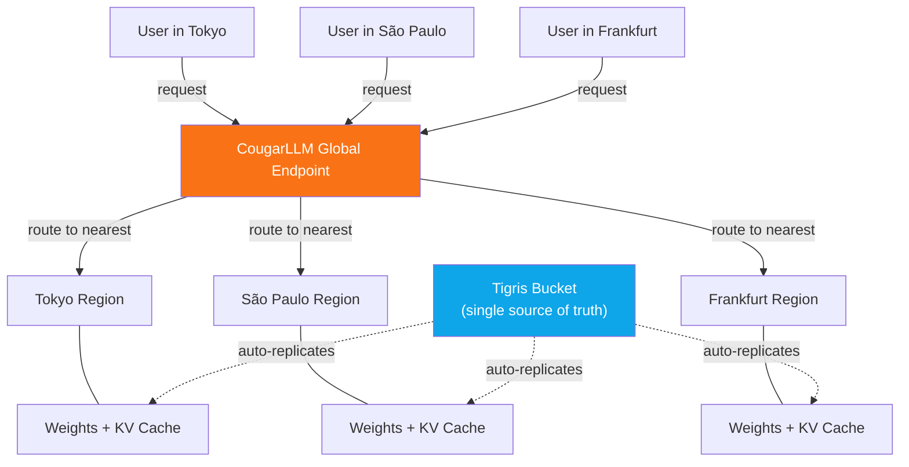

import InlineCta from "@site/src/components/InlineCta";
import PullQuote from "@site/src/components/PullQuote";
import MermaidFrame from "@site/src/components/MermaidFrame";
import ecosystemImage from "./ecosystem.webp";
import heroImage from "./hero-image.webp";


Today we're announcing CougarLLM, a globally distributed inference server built
on Tigris. It takes any open-weight model, distributes its weights globally, and
serves inference from whatever region is closest to your users. Zero egress
fees. One endpoint. No configuration. It's so global, that even your fallback
region has a fallback region.

In our absolutely unbiased internal benchmark, CougarLLM significantly improves
inference latency and reduces serving cost. We will be releasing the benchmark
code within the week.

With CougarLLM, we are stepping onto the same stage as vLLM, TGI, Triton, and
SGLang. They are the household names in modern inference serving, the systems
every team evaluates before production traffic gets real. CougarLLM belongs in
that conversation, but with a dramatic twist: it treats global object storage as
part of the runtime itself. If you want the practical version of that story,
start with
[multi-region bucket placement](/blog/multi-region-dual-region-buckets/).


<p style={{ maxWidth: "42rem", margin: "0.5rem auto 0" }}>
  <em>
    Figure 1: CougarLLM enters the inference group chat with vLLM, Hugging Face
    TGI, NVIDIA Triton, and SGLang, arriving fashionably late but with very
    strong opinions about global storage.
  </em>
</p>

{/* truncate */}

## Why global inference gets painful fast

Most teams start in one region, then add a second when latency complaints become
unavoidable. At that point, users in Tokyo and users in Frankfurt are still
hitting infrastructure that was never designed to feel local everywhere.

The hard part is not one inference server. The hard part is keeping giant model
weights and hot cache state close to users across regions without paying a small
fortune in transfer and operational overhead. This is exactly the kind of data
placement problem Tigris already solves for objects.

<PullQuote>
  We almost shipped yet another agent framework, mostly out of peer pressure.
  Then we noticed teams were burning money shuffling model weights worldwide, so
  we figured an inference server is a safer bet.
  <br />- Ovais Tariq, CEO & Co-founder, Tigris Data
</PullQuote>

Like vLLM, TGI, Triton, and SGLang, CougarLLM serves inference requests. Unlike
most inference servers, it treats globally distributed object storage as part of
the runtime for weights, cache, and rollouts. You bring weights in GGUF,
SafeTensors, or PyTorch format, upload once to Tigris, and serve globally from
there. No region-by-region file choreography.

## A simple architecture diagram

The server works seamlessly. Users send requests to one CougarLLM global
endpoint. That endpoint picks the nearest healthy region for each request. At
the same time, model weights replicate out from a single Tigris bucket so each
region can serve locally. The result is straightforward in theory and chaotic in
practice: one URL, local-ish latency, and no regional replica babysitting.

<MermaidFrame title="CougarLLM routes each request to the nearest region while model weights replicate from a single Tigris bucket.">

</MermaidFrame>
<p style={{ maxWidth: "42rem", margin: "0.5rem auto 0" }}>
  <em>
    Figure 2: CougarLLM request flow. One global endpoint, nearest-region
    routing, and model weights replicating from a single Tigris bucket like this
    was always a totally normal thing to do.
  </em>
</p>

**Global weight distribution.** In this CougarLLM design, Tigris replicates
model weights to regions where requests originate. If traffic shifts from Europe
to Asia, the weights follow. No manual replication, no CDN gymnastics, just
[dynamic data placement](https://www.tigrisdata.com/docs/concepts/regions/)
applied to tensors.

**Single global endpoint.** Your app hits one URL, and CougarLLM routes each
request to the nearest node with warm weights. No region picker, fewer latency
spreadsheets, fewer haunted dashboards.

**Zero egress on weight distribution.** Replicating 70B weights across regions
usually costs real money. On Tigris,
[data transfer is free](https://www.tigrisdata.com/docs/account-management/billing/).
CougarLLM inherits that, so global replication can be aggressively boring from a
billing perspective.

<PullQuote>
  Everyone else is trying to cash in on inference, so this is our extremely
  tasteful attempt to do the same.
  <br />- David Myriel, Head of Trolling at Tigris Data
</PullQuote>

## Why KV cache becomes chaos at global scale

KV cache is why long conversations get expensive fast. It grows with context,
it is session-specific, and it usually gets trapped on one machine.

In CougarLLM, Tigris holds durable KV state while inference nodes keep the hot
working set local for low-latency decoding. That means cross-region recovery can
reuse more context instead of replaying everything from scratch. No, we are not
streaming token-by-token KV reads from object storage.

## Experiment with models without duplicating everything

A 70B checkpoint is large enough that naive copying for every experiment gets
expensive immediately. CougarLLM uses
[Bucket Forks](https://www.tigrisdata.com/docs/forks/) so you clone instantly
and pay for deltas, not for 40 near-identical copies and a prayer.
For the non-joke deep dive, read
[Fork Buckets Like Code](/blog/fork-buckets-like-code/) and
[Bucket Forking Deep Dive](/blog/bucket-forking-deep-dive/).

:::note

[Bucket Forks](https://www.tigrisdata.com/docs/forks/) are a real Tigris feature
you can use today, no CougarLLM required. Any object in a forked bucket shares
storage with the original until it's modified. This works for model weights,
datasets, or anything else you want to branch without duplicating, including
that one "temporary" dataset everyone is weirdly attached to.

:::

## Ship model updates without breaking production

CougarLLM supports **shadow deployments** using the same
[shadow bucket](https://www.tigrisdata.com/docs/migration/) mechanism Tigris
offers for storage migrations. Route a percentage of inference traffic
to the new model, compare outputs, and promote it when you're confident.
Rollback is instant. The old weights are still there, you're just changing
which fork gets traffic, not performing emergency archaeology at 2 a.m.
If you want the production pattern, see
[How to Migrate to Tigris with Shadow Buckets](/blog/shadow-bucket/).

:::warning

CougarLLM is not real. We invented it with complete confidence, three coffees,
and a suspiciously detailed architecture diagram. But everything it relies on is
real.
[Global distribution](https://www.tigrisdata.com/docs/concepts/regions/),
[zero egress fees](https://www.tigrisdata.com/docs/account-management/billing/),
[bucket forks](https://www.tigrisdata.com/docs/forks/),
[shadow buckets](https://www.tigrisdata.com/docs/migration/), and
[S3 compatibility](https://www.tigrisdata.com/docs/api/s3/) are all shipping
features of Tigris today. If this post made you think "I actually want that,"
the building blocks are already here, no fake big-cat branding required.

:::

<InlineCta
  title="Want global storage for your real AI stack?"
  subtitle="Store model weights, datasets, and artifacts close to your users with globally distributed, S3-compatible object storage and zero egress fees."
  button="Get Started with Tigris"
  link="https://www.tigrisdata.com/docs/get-started/"
/>
```
