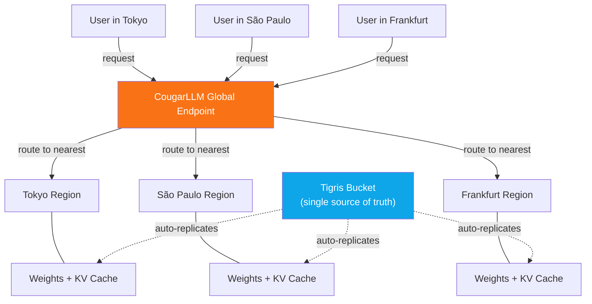

import PullQuote from "@site/src/components/PullQuote";

Today we're announcing CougarLLM, an open-source inference serving layer built on
Tigris. It takes any open-weight model, distributes its weights globally, and
serves inference from whatever region is closest to your users. Zero egress fees.
One endpoint. No configuration.

{/* truncate */}

## The Problem

If you're serving an open model today, you're probably running it in one region.
Maybe two if you're diligent. Your users in São Paulo hit the same endpoint as
your users in Frankfurt, and someone is always getting the short end of the
latency budget.

Replicating model weights across regions is painful. You're copying hundreds of
gigabytes between clouds, paying egress on every transfer, and managing a fleet
of inference servers that need the right version of the right weights at the
right time. Most teams just don't bother — they eat the latency and move on.

We built CougarLLM because this is the same problem
[Tigris](https://www.tigrisdata.com/docs/overview/) already solves for objects.
Model weights are just objects. Very large objects, but objects.

## How It Works

CougarLLM is a serving layer, not a model. You bring your own weights — any
open model that fits in GGUF, SafeTensors, or PyTorch format.
[Upload them once](https://www.tigrisdata.com/docs/model-storage/) to a Tigris
bucket. CougarLLM handles the rest.

**Global weight distribution.** Tigris automatically replicates your model
weights to regions where inference requests are coming from. If traffic shifts
from Europe to Asia overnight, the weights follow. No manual replication, no
CDN in front of your model registry. This is the same
[dynamic data placement](https://www.tigrisdata.com/docs/concepts/regions/)
that Tigris uses for any object — we just pointed it at tensors.

**Single global endpoint.** Your application hits one URL. CougarLLM routes each
request to the nearest inference node that has the weights cached locally.
There is no region picker. There are no latency budget spreadsheets.

**Zero egress on weight distribution.** Moving a 70B model's weights across
regions on other providers costs real money. On Tigris,
[data transfer is free](https://www.tigrisdata.com/docs/account-management/billing/).
CougarLLM inherits that. Replicate your model to every region on earth and pay
nothing for the privilege.

<PullQuote>
  We were spending more on egress replicating model weights than on the GPUs
  running them. With CougarLLM, that line item is gone.
   — Senior ML Platform Engineer, Series B Startup
</PullQuote>

## KV Cache as a Storage Primitive

The key-value cache in transformer inference is the thing that makes long
conversations expensive. It grows with context length, it's per-session, and
it's usually pinned to a single GPU on a single machine.

CougarLLM stores the KV cache in Tigris. This means it benefits from the same
LSM-tree backed storage engine we use for small-object workloads — the same
engine that gives Tigris
[4x the throughput](https://www.tigrisdata.com/docs/overview/benchmarks/aws-s3/)
of other providers on small reads. A KV cache entry is a small object. Millions
of them are a small-object workload. This is what we're good at.

Storing the cache externally also means sessions aren't pinned to a machine. A
user can start a conversation routed to one node and continue it on another
without replaying the full context. The cache is just there,
[globally accessible](https://www.tigrisdata.com/docs/objects/caching/) and
consistent.

## Model Versioning with Bucket Forks

Running experiments on model weights usually means copying them. A 70B model
takes hundreds of gigabytes. Copying it for every fine-tune, every quantization
experiment, every A/B test adds up fast.

CougarLLM uses Tigris [Bucket Forks](https://www.tigrisdata.com/docs/forks/) —
copy-on-write snapshots — for model versioning. Fork a model bucket and you get
an instant, zero-cost clone. Only the weights you actually modify take up
additional storage. Run 50 experiments from the same base model and pay for the
diffs.

:::note

[Bucket Forks](https://www.tigrisdata.com/docs/forks/) are a real Tigris feature
you can use today — no CougarLLM required. Any object in a forked bucket shares
storage with the original until it's modified. This works for model weights,
datasets, or anything else you want to branch without duplicating.

:::

## Zero-Downtime Model Swaps

Swapping a model in production is nerve-wracking. You want to be sure the new
version works before you cut over, but running two full deployments side by
side is expensive.

CougarLLM supports **shadow deployments** using the same
[shadow bucket](https://www.tigrisdata.com/docs/migration/) mechanism Tigris
offers for storage migrations. Route a percentage of inference traffic
to the new model, compare outputs, and promote it when you're confident.
Rollback is instant. The old weights are still there — you're just changing
which fork gets traffic.

## S3-Compatible Model Registry

Your model weights live in a standard Tigris bucket. Every tool that speaks
[S3](https://www.tigrisdata.com/docs/api/s3/) can manage them — upload weights
with the AWS CLI, version them with your existing CI pipeline, set
[lifecycle policies](https://www.tigrisdata.com/docs/buckets/object-lifecycle-rules/)
to archive old checkpoints. There's nothing new to learn.

CougarLLM adds an inference API on top, but the storage layer is plain Tigris.
If you already use Tigris for training data or datasets, your models can live
right next to them.

:::warning

CougarLLM is not real. But everything it's built on is.
[Global distribution](https://www.tigrisdata.com/docs/concepts/regions/),
[zero egress fees](https://www.tigrisdata.com/docs/account-management/billing/),
[bucket forks](https://www.tigrisdata.com/docs/forks/),
[shadow buckets](https://www.tigrisdata.com/docs/migration/), and
[S3 compatibility](https://www.tigrisdata.com/docs/api/s3/) are all shipping
features of Tigris today. If this post made you think "I actually want that,"
the building blocks are already here.

:::

## Try Tigris

CougarLLM may not exist (yet), but Tigris does. If you're storing model weights,
datasets, or anything else that needs to be globally available with zero egress
fees, [get started today](https://www.tigrisdata.com/docs/get-started/).

The real product is better than the fake one. It just doesn't have a cat name.
