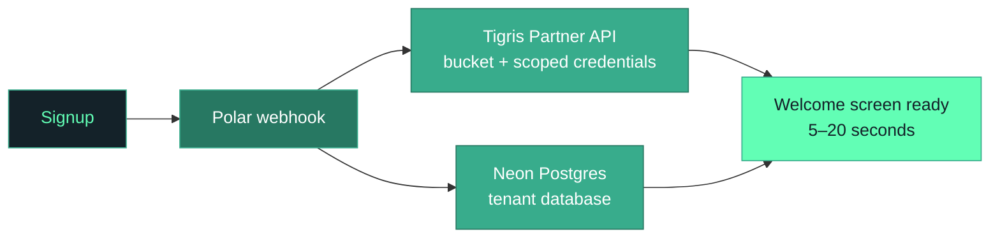
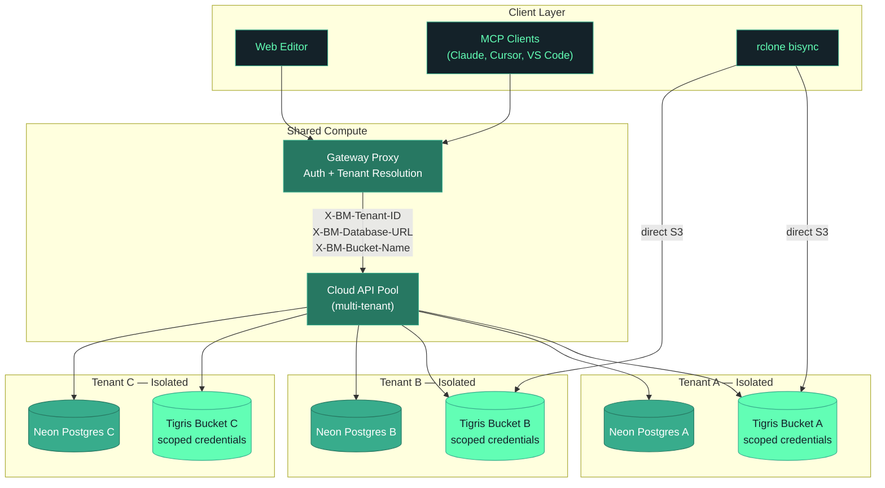
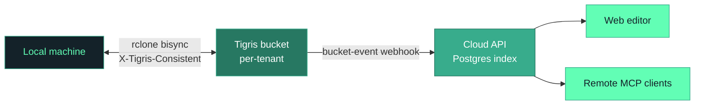
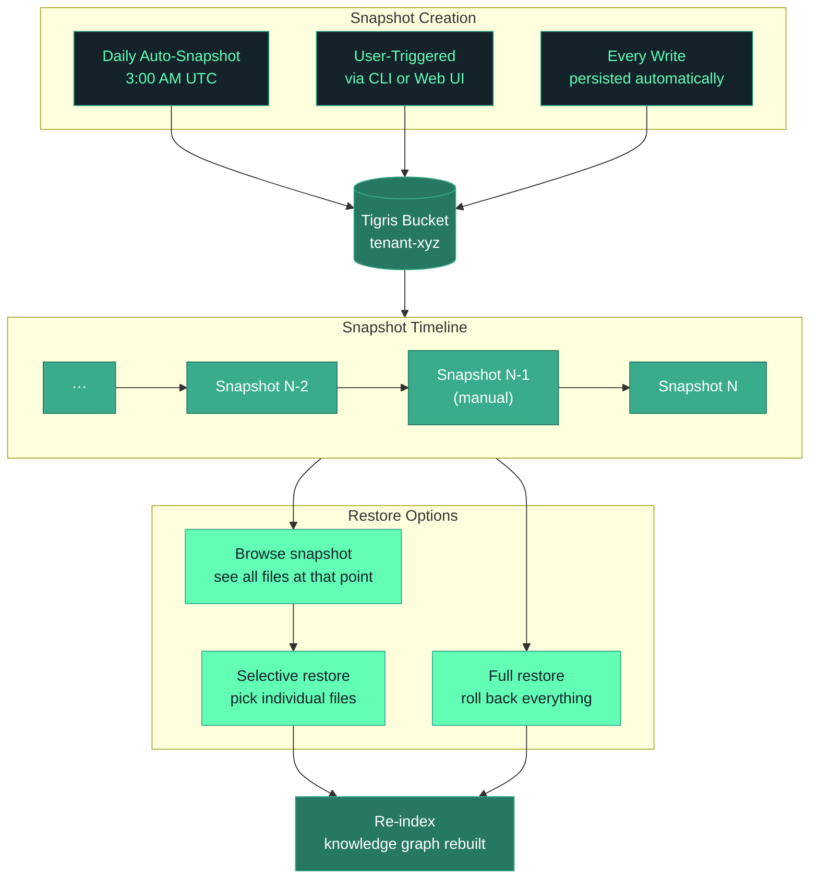

import InlineCta from "@site/src/components/InlineCta";
import BreakoutQuote from "@site/src/components/BreakoutQuote";
import MermaidFrame from "@site/src/components/MermaidFrame";
import QuickSummary from "@site/src/components/QuickSummary";
import heroImage from "./basic-memory-hero.webp";

<QuickSummary
  readTime="6 min read"
  items={[
    {
      title: "Per-tenant isolation.",
      description:
        "Every Basic Memory Cloud user gets their own Tigris bucket with scoped credentials, provisioned automatically at signup.",
    },
    {
      title: "Markdown as objects.",
      description:
        "Users' Markdown knowledge bases are stored directly as S3 objects on Tigris — the same plain text files they can edit by hand or feed into any model.",
    },
    {
      title: "Bidirectional sync.",
      description:
        "Rclone-powered sync keeps local and cloud copies in lockstep, with Tigris's strong-consistency header ensuring fresh reads globally.",
    },
    {
      title: "Point-in-time restore.",
      description:
        "Tigris bucket snapshots let users roll back their entire knowledge base to any previous state.",
    },
  ]}
/>

We are the sum of our experiences. All of your notes, your back and forth with
your AI, your history: all of it shapes how AI tools help us work. There's some
element of _who you are_ that's contained in your context. But it's all so
fragile. Switching models or changing platforms, even just opening a new chat,
resets your most valuable context, and you're back to zero.

[Basic Memory](https://basicmemory.com/) fixes that start-from-zero problem.
Imagine plugging a stenographer into each of your AI interactions, one that
writes down everything you discuss with it, the decisions you make, the
conclusions you reach, and that knows how to call up exactly the details that
matter when you need to refer to them in the future. Users own and control their
own context as a knowledge graph stored in plain Markdown files, no proprietary
formats. You can edit your notes directly via an Apple Notes-esque webapp or you
can use their MCP server directly in your AI tool of choice.

When building their cloud offering, Basic Memory needed a storage backend that
could support their vision technically: strict isolation between tenants,
instant provisioning, and sync that didn't bankrupt the platform. Tigris checked
all these boxes. The bigger thing was that Basic Memory and Tigris believe the
same thing: **you should own your own data, and bring it with you, without
restrictions.**

{/* truncate */}

## Knowledge that belongs to you

Basic Memory started as a Thanksgiving-weekend project in 2024. Paul Hernandez
had spent twenty years writing software for startups and large companies, and he
used Claude and ChatGPT daily. Built-in AI memory was in its earliest infancy.
Chat couldn't possibly save all the information he wanted it to, and Claude
didn't even have a memory at the time. Paul could foresee issues with inevitable
product lock-in once they did. How could he save all the context he wanted? And
how could he switch to a better model without paying the exit tax? When
Anthropic released the
[Model Context Protocol](https://modelcontextprotocol.io/), the path was
obvious: give every AI assistant access to the same knowledge base through a
single MCP server, stored as plain Markdown.

Conversations with any AI produce structured Markdown containing observations,
tags, and wiki-style links between topics. A local SQLite database indexes
everything for full-text search. The MCP server exposes the knowledge base to
Claude, ChatGPT, Gemini, Cursor, VS Code, and any other MCP-compatible tool.
Both the human and the AI read and write the same files.

Basic Memory's edge over built-in AI memory features is partly the sheer volume
of information it can retain, link together, and call up on command. But,
philosophically, their edge (and virtually their one-word motto) is
transparency. Basic Memory's is a folder of Markdown files you can open in any
text editor. With more than 3,000 GitHub stars and 57,000 downloads per month,
it has found its audience among developers and knowledge workers who want to own
their AI context.

<BreakoutQuote
  username="Paul Hernandez"
  title="Founder, Basic Memory"
  imageUrl="https://avatars.githubusercontent.com/u/60959?v=4"
>
  Your knowledge should be yours. AI does what AI does well, but ownership stays
  with the human. Switch models tomorrow, and your knowledge comes with you.
</BreakoutQuote>

## One bucket per brain

The local-first version keeps everything on the user's machine, which is how
users in high-security environments build shared knowledge bases on the
open-source release. In October 2025, the team launched
[Basic Memory Cloud](https://basicmemory.com/cloud), a hosted knowledge base
available across devices, browsers, and AI platforms. The cloud product needed
multi-tenant storage with strict isolation: each user's Markdown files,
organized by project, in a bucket no other user can reach.

<BreakoutQuote
  username="Paul Hernandez"
  title="Founder, Basic Memory"
  imageUrl="https://avatars.githubusercontent.com/u/60959?v=4"
>
  We're really liking Tigris so far as an alternative to AWS S3. We have each of
  our tenants provisioned with their own bucket for data isolation. And tenant
  provisioning takes seconds.
</BreakoutQuote>

Their first build-out was a direct port of the local one. Each tenant got a
dedicated Fly.io server, with their SQLite database and Markdown files on a
per-tenant Fly volume. It worked on day one. It didn't scale. As Paul put it: "a
single server in the cloud, you're just asking for problems." Running N
instances and volumes per user for redundancy spiked the cost.

So they moved the isolation: same servers, different buckets. A small pool of
multi-tenant servers now sits behind a gateway proxy that handles authentication
and routing. Each tenant still gets complete data isolation through their own
Tigris bucket, their own Neon Postgres database, and scoped credentials that can
only reach their data. **Storage is strictly per-tenant; compute is shared.**
The platform runs on a handful of servers instead of N, and per-user cost stops
scaling linearly with users.

<BreakoutQuote
  username="Paul Hernandez"
  title="Founder, Basic Memory"
  imageUrl="https://avatars.githubusercontent.com/u/60959?v=4"
>
  Everything is a distributed file system — a giant key-value store in the
  cloud. By keeping Markdown files in S3-compatible object storage and indexing
  them into Postgres, we get a system that's simple, scalable, and extremely
  cost efficient.
</BreakoutQuote>

That architecture only works if per-tenant bucket creation is cheap, fast, and
programmatic. The
[Tigris Partner Integration API](https://www.tigrisdata.com/docs/partners/) does
that. A user signs up, [Polar](https://polar.sh) fires a webhook to Basic
Memory, and within 5 to 20 seconds the tenant is fully provisioned: Tigris
bucket, Neon Postgres database, scoped credentials, and all internal
configuration. Users see a brief spinner on a welcome screen, and the platform
is ready.

<MermaidFrame title="Tenant provisioning, end to end. From Polar webhook to a usable workspace in 5–20 seconds.">

</MermaidFrame>

Each tenant gets their own bucket with credentials that can only reach that
tenant's data. Projects within a knowledge base are organized as prefixes inside
the bucket. There is no shared "tenants" bucket, no row-level security to get
wrong, no custom isolation layer to maintain.

At runtime, the gateway proxy resolves the tenant from the request, attaches the
right credentials and database URL as headers, and the shared API pool reads and
writes against that tenant's bucket and Postgres only. The rclone sync path
skips the API entirely and talks straight to the tenant's bucket with its own
scoped credentials.

<MermaidFrame title="Shared compute, per-tenant storage. The gateway proxy resolves tenancy; the bucket is the isolation boundary.">

</MermaidFrame>

<BreakoutQuote
  username="Paul Hernandez"
  title="Founder, Basic Memory"
  imageUrl="https://avatars.githubusercontent.com/u/60959?v=4"
>
  Using buckets has become flexible and easy. We create and destroy buckets
  systematically even during unit tests. It lets our small team iterate and
  build faster.
</BreakoutQuote>

## Sync that pays for itself

Users own their files. That's a core design principle, and the cloud product
extends it: edit locally in Obsidian or VS Code and sync to the cloud, or edit
entirely in the cloud via the web editor and sync back down. Any amount of data
can flow either direction. On a traditional cloud that's a cost problem; on
Tigris, Basic Memory ignores how much data leaves their platform.

The sync engine is `rclone bisync`, pointed at Tigris's S3-compatible endpoint.
Each sync fetches the tenant's scoped credentials from the cloud API, then runs
a bidirectional sync between the local project directory and the corresponding
path in the tenant's Tigris bucket. Markdown files are stored as-is — the same
files you'd edit locally are the same objects sitting in S3.

Tigris is globally distributed by default. A user in Singapore writing from
Cursor hits a nearby Tigris region instead of round-tripping to a single origin.
That latency math is what makes "sync everywhere" feel instant rather than
tolerable. The cloud product would be a noticeably worse product if reads always
came from one region.

Global distribution comes with one tradeoff: edge caches can return slightly
stale data for reads far from the origin. Basic Memory handles this by sending
the `X-Tigris-Consistent: true` header on every rclone operation, forcing
strongly consistent reads and preventing subtle sync issues. The header is
applied globally rather than per-method because bisync starts with an S3
`ListObjectsV2` call, which isn't a download or an upload — list-only headers
would miss it. It's a small detail, but it's the kind of thing that turns "works
in demo" into "works in production."

For new objects landing in a tenant's bucket from any path — the rclone sync,
the web editor, or the API —
[Tigris bucket event notifications](https://www.tigrisdata.com/docs/buckets/object-notifications/)
tell the cloud API which files changed, so the indexer re-reads only what it
needs. No polling, no scheduled scans.

<MermaidFrame title="How an edit flows through Basic Memory. Writes from any path converge cleanly at the index.">

</MermaidFrame>

Egress is the load-bearing economic detail. Users sync files back and forth all
day, and agents re-read the same notes while building context. That bill
compounds fast. Zero egress is how a four-person team can offer sync to every
customer at a price they'll pay.

<BreakoutQuote
  username="Paul Hernandez"
  title="Founder, Basic Memory"
  imageUrl="https://avatars.githubusercontent.com/u/60959?v=4"
>
  Without zero egress, sync per user is a margin killer. With Tigris, it's the
  mandate that makes the platform work.
</BreakoutQuote>

## A time machine for your knowledge base

Months of AI conversations build up massive context. Losing it because you
switched tools is the worst-case scenario for memory like this. Basic Memory
uses
[Tigris bucket snapshots](https://www.tigrisdata.com/docs/buckets/snapshots-and-forks/)
to give every user point-in-time restore, and exposes the whole thing through
the CLI: create, list, browse, delete, and restore from any snapshot.

Snapshots are built for convenience. People don't reach for a Git-style
three-way merge. They want yesterday's version back.

Though all writes to Tigris are persisted as snapshots, Basic Memory also runs
automated daily snapshots per tenant for easy fallback, and users can create
manual snapshots whenever they want. The restore flow lets them select
individual files from an old snapshot and revert them one at a time — no
all-or-nothing rollback required. Because the knowledge graph and search index
are derived from the files, restoring a snapshot brings back the whole graph
after a re-index.

<MermaidFrame title="Snapshots converge from three sources into a timeline, then fan out into per-file or full restore.">

</MermaidFrame>

### File-level history, for free

Bucket-level snapshots cover the catastrophic case: full restore, whole-bucket
rollback. But because every write to a Tigris bucket carries a version SHA,
Basic Memory was able to build something more granular on the same primitive.
Their upcoming web editor includes per-file revision history: a
`ListObjectVersions` call returns every version of a single Markdown file,
loaded side-by-side in a CodeMirror MergeView with a picker for applying
changes.

<video controls width="100%">
  <source
    src="/blog/img/blog/case-study-basic-memory/basic-memory-file-versions.mp4"
    type="video/mp4"
  />
  Download the <a href="/blog/img/blog/case-study-basic-memory/basic-memory-file-versions.mp4">
    MP4
  </a> version.
</video>

<BreakoutQuote
  username="Paul Hernandez"
  title="Founder, Basic Memory"
  imageUrl="https://avatars.githubusercontent.com/u/60959?v=4"
>
  Each revision in a bucket has a SHA, and we were able to make a diff/merge for
  file-level revisions really easily. I had experimented with integrating Git
  for this and it was such a chore. This pairs really nicely with our
  bucket-level snapshot feature — a user can use snapshots to manage versions
  for large numbers of files, or use the file history for a single file.
</BreakoutQuote>

## What Tigris solved that other clouds didn't

Paul previously worked at the biggest AWS customer in Austin, so he knew what
$bigCloud infrastructure costs in commitment — the kind of complexity that comes
from being too big to question. He dealt with account vending machines for new
tenants, continual quota-increase requests as the user base grew, and the exit
tax of egress fees if you ever wanted to run compute on another provider.

<BreakoutQuote
  username="Paul Hernandez"
  title="Founder, Basic Memory"
  imageUrl="https://avatars.githubusercontent.com/u/60959?v=4"
>
  I wanted to build on a modern stack that lets us do right by our users — not
  lock them in or charge them more than we have to. What I appreciate about
  working with Tigris is that they approach it the same way. They're not trying
  to squeeze us on pricing, and having a provider that thinks like that means we
  can pass those savings and that trust directly down to our users.
</BreakoutQuote>

He wanted to build differently. Tigris fit:

| What Tigris provides           | Why it matters for Basic Memory                                                                         |
| ------------------------------ | ------------------------------------------------------------------------------------------------------- |
| **Partner Integration API**    | Per-tenant org, bucket, and scoped credentials in 5–20 seconds — no custom isolation layer to maintain. |
| **Globally distributed reads** | Users syncing from many devices and locations get low-latency reads from the nearest Tigris region.     |
| **Bucket event webhooks**      | The indexer reacts to file changes instead of polling. Both write paths converge cleanly at the index.  |
| **Bucket snapshots**           | Point-in-time restore as an API call. Daily automatic, plus user-triggered, plus per-file restore.      |
| **Zero egress fees**           | Bidirectional per-user sync stays economically viable. Agents can re-read the knowledge base freely.    |

Basic Memory is a four-person team building a product they want to run
themselves at a price their customers will pay. Big-cloud sales motions — yearly
commits, hard upsells, opaque billing — don't fit that shape.

<BreakoutQuote
  username="Paul Hernandez"
  title="Founder, Basic Memory"
  imageUrl="https://avatars.githubusercontent.com/u/60959?v=4"
>
  Tigris is the good parts of AWS without the bad parts. A lean team can build a
  real product on it, and the customer pays a price they can afford. That's the
  deal.
</BreakoutQuote>

## What's next

Basic Memory recently shipped an updated web editor, improved semantic search,
conversation import from ChatGPT and Claude, and per-project cloud routing —
individual projects can route through the cloud while others stay local. Coming
soon is a **teams product**: organizations where each user keeps their own
bucket but shares an organization-level bucket for common knowledge. New team
members can fork the shared bucket and start with a base set of notes instantly.

Regional bucket placement is on the roadmap too. One open-source user is the
CISO of an EU bank using Basic Memory to manage bank infrastructure processes,
and EU data sovereignty rules dictate exactly where bytes can live. With Tigris,
putting a tenant's bucket in a specific region is a configuration choice, not a
project.

For a four-person team, the less time spent on storage infrastructure, the
better. Tigris handles tenant isolation, sync, snapshots, and global
distribution. Basic Memory spends that runway building something most AI
products refuse to: a memory layer the user actually owns.

<InlineCta
  title="Build a multi-tenant product on Tigris"
  subtitle="The Partner Integration API gives every one of your users their own isolated bucket with scoped credentials in seconds — no custom isolation layer to maintain."
  button="Read the Partner API Docs"
  link="https://www.tigrisdata.com/docs/partners/"
/>
