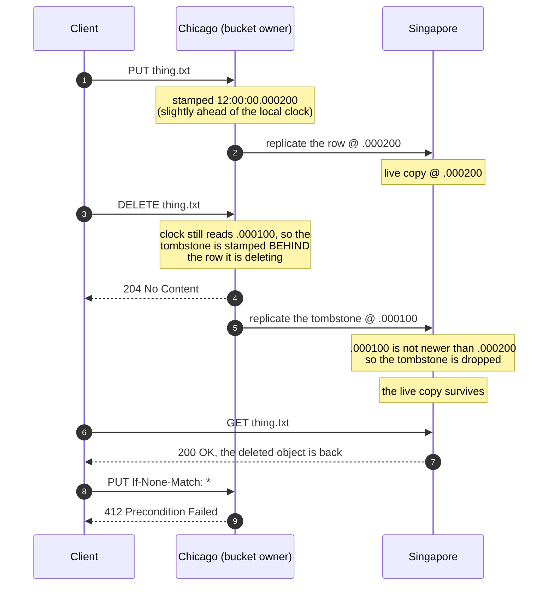
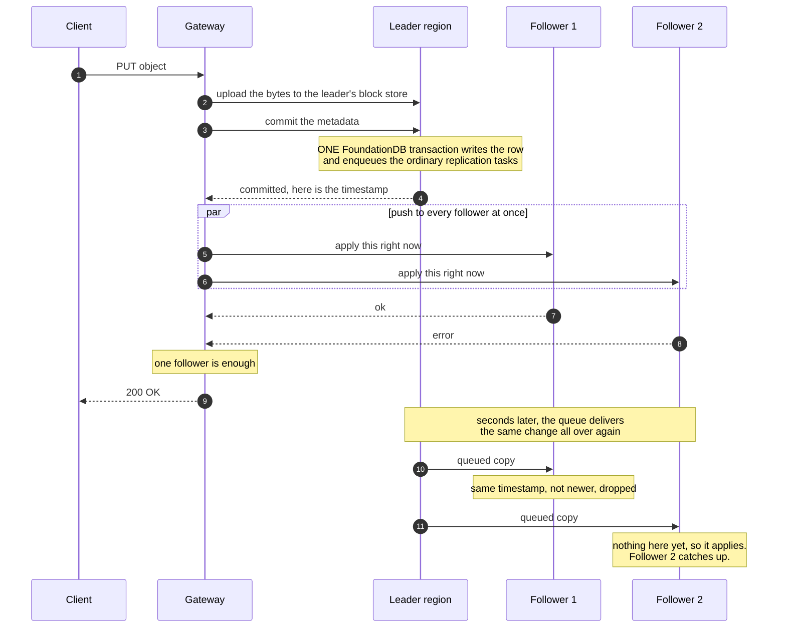
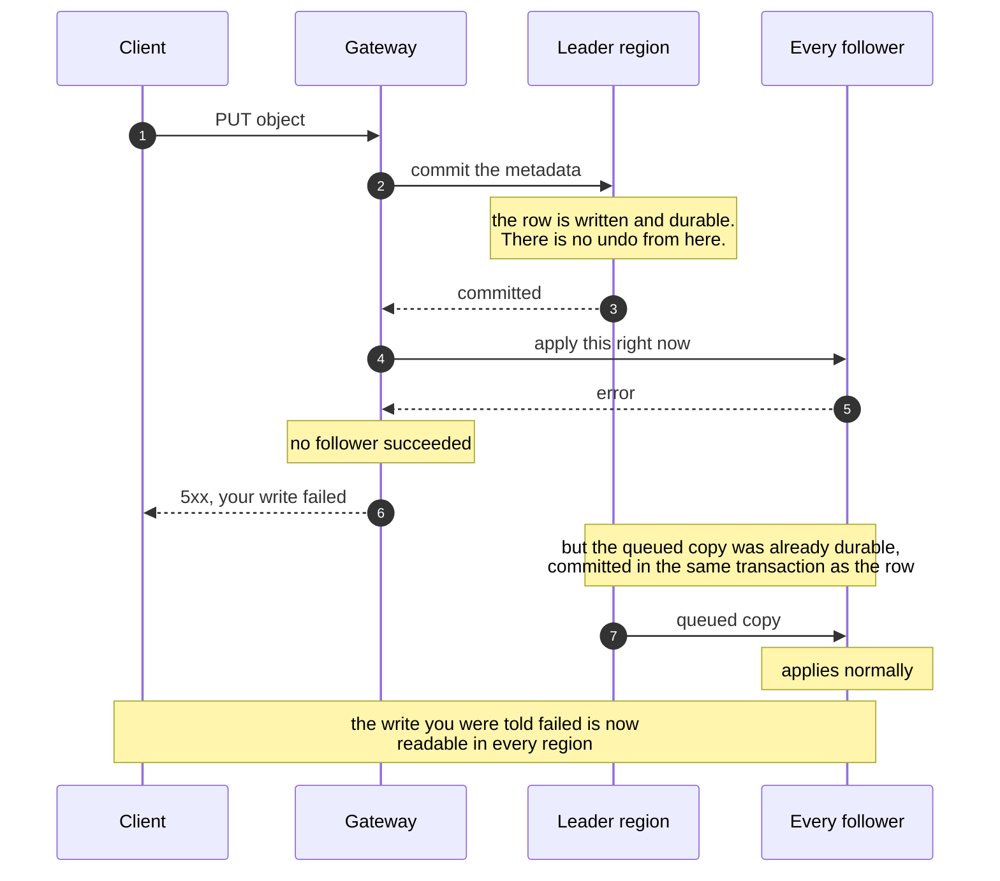

import InlineCta from "@site/src/components/InlineCta";
import heroImage from "./hero-image.webp";

import SingleRegionFlow from "./diagrams/SingleRegionFlow";
import CompareFlow from "./diagrams/CompareFlow";
import ReplicasetSharding from "./diagrams/ReplicasetSharding";

One of the hardest problems in distributed systems is conflict resolution, or
the same basic problem as merge conflicts in Git. Git merge conflicts happen
when your branch differs from upstream in a way that Git can’t easily work its
way around so it exposes both sides of the changes to humans and has the human
(or their agent) figure out which side is “correct”. Distributed systems don’t
really have this same flow as the scale of changes is often impossible for any
human or team of humans to keep up with.

As a result, we _really_ want to have our own business logic define which side
of a conflict wins. FoundationDB doesn’t let us do that out of the box, so we
had to make our own layer. The neat part about being able to do this is that
this lets us control the replication behaviour of buckets based on user needs.
The three main ways it differs are with
[single-region buckets](https://www.tigrisdata.com/docs/buckets/locations/#single-region),
[multi/dual-region buckets](https://www.tigrisdata.com/docs/buckets/locations/#multi-region),
and [global buckets](https://www.tigrisdata.com/docs/buckets/locations/#global).
I’m going to cover the replication differences in the order of complexity.

## Single-region buckets

One of the easiest conflict resolution methods we have is a
[single-region bucket](https://www.tigrisdata.com/docs/buckets/locations/#single-region),
which prevents any need for it. In this mode all actions are reverse proxied to
the bucket’s region and any metadata changes are local to that region in
particular. This means that any other regions trust the changes made by the
bucket’s region and reject any changes made by any other regions. As a side
effect this also means that the data _does not_ move between regions like other
buckets do. You’d think that would mean “if a region goes down, my bucket goes
down.” But we have implemented data proxying, which means that if that region’s
block storage is still available, other gateways can route requests to it and
you can still access your data come hell, high water, or Giant Meteors.

The conflict resolution flow is like this:

  <SingleRegionFlow />

The main tradeoff with a single-region bucket is that you trade _strict
consistency_ (because there is only one possible writer) with _higher latency_
(unless all of your workload is geographically close to that Tigris region in
particular). This makes a Tigris bucket mostly behave like a region-locked S3
bucket with the exception of being able to query the files globally without
having to configure your client to access that particular region.

## Global buckets

That was nice and simple. In comparison, global buckets are not.

Global buckets let any region be authoritative for any aspect of the bucket or
any object in the bucket. Any changes get committed to the local FoundationDB
cluster and then lazily replicated out to the other regions. This also means
that we expect there to be some level of conflict. Imagine an object storage
bucket like a git repository. You end up having conflicts when multiple people
push to the same files. How do we decide who wins? You can’t just have a person
sit there and decide which version of an object is right all the time.

Remember that we run a separate FoundationDB cluster per region. FoundationDB
has a sequencer that gives version identity to everything in the cluster. Those
versions are also based on time so you think we’d just be able to use those and
compare them to know which version is the newest, right? Well, it turns out that
FoundationDB versionstamps aren’t comparable across clusters as they’re partly
based on the cluster’s creation date and all of our clusters were created at
different times as we scaled globally. So we have to use something else that
changes fairly constantly between clusters in a way that’s easy for us to
validate without too much extra effort. Ideally, it’s something we already keep
in sync for making sure everything else in the system works.

Like many other things in Tigris, we use time to determine who wins a conflict.

:::note

Using time for this sounds boring, but time synchronization is unironically one
of the [most complicated things in computing](https://youtu.be/zT71UvUxhjU).
This is a field where phrases like “temporal smearing”, “false ticker” and
“clock skew” are thrown around freely and ends up being a mess in practice. It’s
a small miracle that any of this works in practice.

:::

Here’s a paraphrased and reformatted version of our conflict resolution
function:

  <CompareFlow />

Or: we prioritize the most recent entry when possible, accounting for deletions
and the like such that a newer delete wins over an older update. This combined
with eventual consistency means that there are potentially situations where one
region updates an object and another region deletes it at the same time. During
that small replication window you can get a situation where Singapore says an
object exists that Chicago says doesn’t exist, but in practice the replication
delay is small enough (single digit seconds or thereabout) that it doesn’t
matter.

:::note

In theory we could have done this by breaking out exotic things like
[conflict-free replicated data types](https://en.wikipedia.org/wiki/Conflict-free_replicated_data_type),
but that seems kinda overkill for our usecase. That would work great for the
source control merge conflict problem though!

:::

### Time keeps ticking

At this point clock skew is also a factor. We run NTP clients on all our
infrastructure and that usually keeps us within about 10 microseconds (10,000
nanoseconds) off of NTP time. Given that we measure timestamps as nanoseconds to
decide conflicts, clock skew-based ordering conflicts can genuinely be a factor.

Imagine that the two operations in Chicago were served by different servers that
just so happen to have their clocks off by a fraction of a fraction of a second.
A DELETE could be sequenced before a PUT and the object could be shown as
deleted in Chicago but present in Singapore because that PUT replicated out
_after_ the delete was committed locally.

According to all the rules of the game, every region but Chicago sees that the
DELETE is slightly older than the current data, so it ignores that DELETE and
continues as if that PUT is the right state of the world.

This is the kind of race condition you can only really see in distributed
systems at our scale or larger. Nothing that happens in this situation is a
failure in the logic or implementation, it’s just a desync because of
unfortunate timing.

I wish I could tell you an epic tale of time synchronization and other fun
things along the way of fixing this particular issue, but the fix was sadly
boring. We just refuse to process a DELETE when the DELETE is older than the
data in the database. If the DELETE doesn’t land after the database row’s date,
we re-read the clock and try again every 100 milliseconds up to 5 (five) times.
If even that can’t result in a timestamp that sorts correctly we give up loudly
to the client instead of quietly doing the wrong thing.

:::note[-Wpedantic]

Our conflict resolution is only as good as our clocks are. Time synchronization
like this is kind of a hard problem to solve and we’d like to avoid having to do
that if we can. If this becomes an issue in the future, we may have to build
sacrificial lamb servers with
[Cesium/Rubidium time cards](https://store.timebeat.app/products/ocp-tap-timecard)
and deploy those in our datacentres, kinda like the atomic clocks Google uses
for Spanner. That would certainly make for a cool project!

Come to think of it, the premise of Neal Stephenson’s Anathem (where a group of
timekeeping monks lock themselves in giant clocks as part of their timekeeping
practices) makes a lot more sense after working in distributed systems for as
long as I have. If timekeeping magic is all that we’ve known, it really is easy
to miss what really goes on.

:::

## Multi-region buckets

Finally we have multi-region buckets. These are the most complicated as they
combine aspects of both single-region and global buckets. There wasn’t a
protocol off the shelf that would do this for us– FoundationDB uses Paxos\*
internally, and I’ve read about MultiPaxos (and Matchmaker Paxos,
[Matchmaker MultiPaxos](https://mwhittaker.github.io/publications/matchmaker_paxos.pdf),
it goes on…). It seems like everyone modifies the algorithm for their use case,
I wonder if there is a “true” Paxos outside of academia. Maybe it was
implemented by the one true Scotsman.

We replicate multi-region bucket metadata by having one region be the leader for
a group and having that leader actively push out changes as well as enqueueing
them like a global bucket. This means that the regions in the group get the data
faster than they would otherwise and commits to the leader mean that the data is
committed to all members of the group. It’s kinda like this:

When a client writes to a multi-region bucket, Tigris forwards the write to the
leader and blocks there. If the leader can’t take it, the write errors out and
nothing changes. If the leader commits the change, the gateway actively pushes
that change out to the other regions in the group in parallel and waits for them
to commit before answering the client. Interestingly enough, it uses the same
codepath that the global replication workers use. Every region in the group is
going to get this change twice: once from the fan-out on the leader’s commit and
the other from the queue worker pushing it out a moment later.

This may also seem like a race condition, but remember that the replication rows
contain the before and after state, a-la
[Postgres logical replication](https://www.postgresql.org/docs/current/logical-replication.html)
or git commit syncing. If the current data in the database is newer or the same
as the data being pushed out, the change is ignored and the cluster moves on
with life:

At some level you can think about multi-region buckets as a latency optimization
for the regions in the multi-region group. The replication queue is what
actually guarantees the global convergence of metadata, but the active fan-out
over regions is what gets there first. This means that if you have a
multi-region bucket in the EU and all your workloads are in the EU, you get a
lot of the same availability advantages of global buckets without a lot of the
consistency risks of normal global buckets.

:::note

Given that this replication protocol isn’t a genuine two-phase commit (one phase
local, the second phase when the rest of the group has all committed), it means
that there is theoretically a case where a client can push a change to the
bucket, have that commit locally, fail to eagerly push out the changes at the
gateway level, and then return an error to the client after the data
successfully was written. The queue would then lazily replicate out the data
like nothing happened, meaning that the change would be pushed out even though
it technically failed.

HTTP doesn’t really have a good error code for this kind of partial failure and
the S3 API definitely does not either. If this becomes a problem in practice,
we’ll have to create an S3API extension for this. Stay tuned!

:::

## Replication brings its own challenges

Our current system has handled all customer load without too many issues. So
that any region can answer questions about the data, all metadata is replicated
to every region, even if it’s not requested anywhere else. This means that for
even single region buckets, there’s the same load on the replication queue as
there is for global buckets.

To work around this, we can compartmentalize the activities for these single
region buckets by sharding our FoundationDB clusters by bucket type, or even by
tenant, so the replication queue doesn’t risk lagging. We have a finite number
of replication workers and if too many objects change all at the same time it
can cause the replication delay to be minutes instead of seconds. The technical
term for this is “bad”.

Right now there’s one central FoundationDB cluster per region which stores
everything. In the future we plan to have one cluster that’s used to map
metadata about which buckets/organizations belong to which clusters, and from
there we will scale out depending on customer request pressure. If you’re a
large enough tenant, you may end up getting your own dedicated FoundationDB
cluster!

  <ReplicasetSharding />

:::note

Pop quiz for people reading this post via social media: which Massively
Multiplayer Online Roleplaying Game is the origin of the term “sharding” and
what happened to cause that to need to be done? The first person to answer right
without searching wins the sense of pride and accomplishment that comes with
being right on the Internet first.

:::

This does come with the obvious downside of having to manage multiple clusters,
but we think the tradeoff is worth it when it eliminates the problem of noisy
neighbors causing replication delay. It will mean that our caching layer has to
be a bit more complicated (at the very least we expect the mapping of
organizations/buckets to FoundationDB clusters to be fairly stable), but that’s
just a simple matter of programming at this point. It’s also gonna make
replication “fun”, but we’ll cross that bridge when we come to it.

## Conclusion

There’s three types of buckets but all of them use different shades of the same
global replication logic. Most of the levers we offer are all around
consistency, latency, and availability. Single region buckets remove the
question of where the data is stored at the cost of making that one region a
single point of failure. Global buckets embrace conflicts but can be a more
latent when changes are replicated out. Multi-region buckets double-replicate
your data across the cloud. All of these happen in regions that are far apart
enough that synchronous round trips are genuinely expensive, but everything is
just implementation details for the same basic object storage operations.

Computers really are something at this scale, aren’t they? The joys of our
industry know no end.

<InlineCta
  title="Need your own replicaset on Tigris?"
  subtitle="If your workload is big enough, you could end up with a dedicated FoundationDB cluster all to yourself. Give us a shout and let's see if your data qualifies."
  button="Get in touch"
  link="mailto:help@tigrisdata.com"
/>
